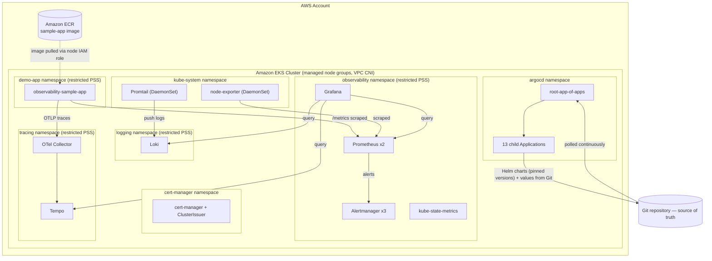

# Enterprise Observability Platform on Amazon EKS

**Implementation Guide** — architecture, deployment, monitoring configuration, and operations,
for a production-shaped observability platform (metrics, logs, traces, dashboards, alerting) on
Amazon EKS, delivered through GitOps.

**Audience:** DevOps / Platform / SRE engineers operating or extending this platform.
**Scope:** complete lifecycle — infrastructure planning through day-to-day operations and troubleshooting.

---

## Table of Contents

1. [Solution Overview](#1-solution-overview)
2. [Amazon EKS Fundamentals](#2-amazon-eks-fundamentals)
3. [AWS Infrastructure Planning](#3-aws-infrastructure-planning)
4. [Creating the Amazon EKS Cluster](#4-creating-the-amazon-eks-cluster)
5. [Amazon EKS Resources Used in This Implementation](#5-amazon-eks-resources-used-in-this-implementation)
6. [Repository Structure](#6-repository-structure)
7. [Application Deployment Flow](#7-application-deployment-flow)
8. [Helm Deployment](#8-helm-deployment)
9. [Kubernetes Deployment Detail](#9-kubernetes-deployment-detail)
10. [Observability Architecture](#10-observability-architecture)
11. [Prometheus Implementation](#11-prometheus-implementation)
12. [Grafana Implementation](#12-grafana-implementation)
13. [Amazon EKS Day-to-Day Operations](#13-amazon-eks-day-to-day-operations)
14. [CLI Reference](#14-cli-reference)
15. [Troubleshooting Guide](#15-troubleshooting-guide)
16. [Best Practices](#16-best-practices)
17. [Complete Deployment Workflow](#17-complete-deployment-workflow)
18. [Appendix](#18-appendix)

---

## 1. Solution Overview

### 1.1 Project Overview

This platform provides full-stack observability — **metrics, logs, and distributed traces** —
for workloads running on Amazon Elastic Kubernetes Service, unified in Grafana and backed by
automated alerting. Every cluster resource is declared in Git and reconciled continuously by
ArgoCD, so the Git history of this repository is the authoritative change history of the
cluster: there is no class of production change that happens outside version control.

A reference workload (`observability-sample-app`, an instrumented ASP.NET Core service) is
deployed alongside the platform to prove the pipeline against real traffic rather than
synthetic checks.

### 1.2 Objectives

- Deploy a highly-available metrics, logging, and tracing stack on Amazon EKS.
- Manage 100% of cluster state through GitOps (ArgoCD) — no manual `kubectl apply` of workload
  state.
- Enforce an enterprise security baseline: namespace multi-tenancy, least-privilege RBAC,
  default-deny NetworkPolicy, restricted Pod Security Standards.
- Provide dashboards and alert rules as version-controlled code, not manual Grafana/Alertmanager
  UI configuration.
- Prove cross-pillar correlation — one request, traceable through metrics, logs, and traces
  simultaneously.

### 1.3 Scope

**In scope:** AWS infrastructure planning, cluster architecture, GitOps delivery,
metrics/logs/traces stack, dashboards, alerting, RBAC, network segmentation, Helm packaging,
day-2 operations.

**Out of scope (see [§18.1](#181-useful-links) for where to take these further):** identity
federation to a live corporate IdP (the RBAC layer is IdP-ready but not bound to one),
production-scale long-term metrics/log/trace retention tuning, and a CI pipeline for this
repository itself.

### 1.4 High-Level Architecture



### 1.5 Repository Structure

```
.
├── bootstrap/            # ArgoCD installation + the root App-of-Apps Application
├── argocd-apps/          # One ArgoCD Application manifest per platform component (14 total)
├── manifests/            # Desired-state Kubernetes YAML each Application reconciles
│   ├── namespaces/           namespace + ResourceQuota + LimitRange, per tenant
│   ├── rbac/                 least-privilege Role/RoleBinding, bound to Groups
│   ├── network-policies/     default-deny + explicit allow NetworkPolicies
│   ├── security/              ClusterIssuer and related security objects
│   ├── cert-manager/          cert-manager install
│   ├── kube-prometheus-stack/ Prometheus/Grafana/Alertmanager Helm values
│   ├── loki/                  Loki + Promtail Helm values
│   ├── tempo/                 Tempo + OTel Collector Helm values
│   ├── sample-app/            reference workload Deployment/Service
│   ├── dashboards/            Grafana dashboard JSON + Kustomize wrapper
│   └── alert-rules/           PrometheusRule definitions (node health, crash-loops, SLO)
├── charts/                # Distributable Helm chart packaging of the same stack
│   └── observability-eks/    EKS-native chart: kube-prometheus-stack + Loki + Tempo + OTel
├── scripts/               # Cluster bootstrap and end-to-end validation automation
├── docs/                  # Architecture and operational reference documentation
└── observability-sample-app/  (separate repository) instrumented reference workload
```

### 1.6 Technology Stack

| Layer | Technology | Version |
|---|---|---|
| Managed Kubernetes | Amazon EKS (managed node groups) | 1.31 |
| GitOps controller | ArgoCD | 3.4.5 |
| Package manager | Helm | 4.1.4 |
| Metrics | Prometheus (via kube-prometheus-stack) | chart 87.15.2 |
| Alerting | Alertmanager | chart 87.15.2 (bundled) |
| Dashboards | Grafana | chart 87.15.2 (bundled) |
| Logs | Grafana Loki + Promtail | chart 7.0.0 / 6.17.1 |
| Traces | Grafana Tempo + OpenTelemetry Collector | chart 1.24.4 / 0.165.0 |
| Reference workload | ASP.NET Core (.NET 10), OpenTelemetry-instrumented | — |
| Image registry | Amazon ECR | — |
| Identity | IAM Roles for Service Accounts (IRSA) | — |
| Networking | Amazon VPC CNI, native NetworkPolicy enforcement | — |
| Storage | Amazon EBS (`gp3`, via the EBS CSI driver) | — |

### 1.7 Solution Workflow

```
Git commit (manifest / Application / values change)
        │
        ▼
ArgoCD detects drift (poll + webhook)
        │
        ▼
ArgoCD renders Helm charts / applies manifests
        │
        ▼
Amazon EKS API server schedules/updates resources
        │
        ▼
Prometheus discovers new/changed targets automatically (ServiceMonitor)
        │
        ▼
Grafana dashboards and Alertmanager rules reflect the new state
        │
        ▼
selfHeal continuously reconciles — any out-of-band change is reverted
```

---

## 2. Amazon EKS Fundamentals

DevOps-relevant essentials only — this is not a general Kubernetes tutorial.

| Concept | What it is | Relevance to this platform |
|---|---|---|
| **EKS Control Plane** | AWS-managed API server, scheduler, controller-manager, etcd, running across multiple Availability Zones — no node access, no maintenance burden | We consume the API server endpoint only; AWS patches/upgrades it per the cluster's Kubernetes version |
| **Worker nodes** | EC2 instances that run pods, grouped into node groups | Sized `m5.xlarge`, 3+ nodes, for this platform's steady-state footprint |
| **Managed Node Groups** | AWS-provisioned and lifecycle-managed EC2 Auto Scaling groups backing the cluster | The node model this platform is built for — see [§16.9](#169-managed-node-groups-vs-fargate) |
| **Self-managed Nodes** | EC2 instances you provision and join to the cluster yourself, outside AWS's managed node group lifecycle | Not used in this implementation — managed node groups remove that operational burden with no functional trade-off here |
| **Fargate Profiles** | AWS-provisioned serverless pod execution — one micro-VM per pod, no node management at all | Not used — two components in this stack need DaemonSet/EBS access Fargate does not support; see [§16.9](#169-managed-node-groups-vs-fargate) |
| **Pods** | Smallest deployable unit — one or more containers sharing network/storage | Every container in this platform (Prometheus, Grafana, the sample app, …) runs inside a pod |
| **Workloads** | The umbrella term for anything scheduled onto nodes (Deployments, StatefulSets, DaemonSets, Jobs) | Every platform component is a workload reconciled by ArgoCD |
| **Deployments** | Declarative, rolling-update-capable management of stateless ReplicaSets | Grafana, the sample app, OTel Collector |
| **Services** | Stable virtual IP + DNS name load-balancing across matching pods | Every component is reached by its Service DNS name, never a pod IP |
| **Namespaces** | Logical isolation boundary within a cluster | One per tenant/concern — `observability`, `logging`, `tracing`, `demo-app`, plus platform namespaces |
| **Storage** | Dynamic block storage provisioning backed by Amazon EBS via the EBS CSI driver | Backs Prometheus/Alertmanager/Grafana/Loki/Tempo state |
| **Networking (VPC CNI)** | Pods get real, routable IP addresses directly from the VPC's subnet ranges | Required for the platform's NetworkPolicy enforcement to have any effect |
| **IAM** | AWS's identity/permission system, cluster-external | Controls who can administer the EKS cluster itself and its supporting AWS resources |
| **IAM Roles for Service Accounts (IRSA)** | Binds a Kubernetes ServiceAccount to an IAM role via the cluster's OIDC provider, so a pod can call AWS APIs without static credentials | Used so pods (Loki, Tempo, the sample app's image pull) authenticate to AWS APIs without any long-lived key stored as a Kubernetes Secret — see [§9.6](#96-irsa-bindings) |

---

## 3. AWS Infrastructure Planning

### 3.1 AWS Account and IAM

| Item | Requirement |
|---|---|
| AWS Account | Dedicated account (or a dedicated environment within an AWS Organization) |
| IAM permissions (operator) | `AmazonEKSClusterPolicy`-equivalent admin access, or a scoped IAM policy covering `eks:*`, `ec2:*` (networking), `iam:CreateRole`/`iam:CreatePolicy` for cluster and IRSA setup |
| IAM OIDC provider | Associated with the cluster at creation time (`--with-oidc`) — required for IRSA |
| Local tooling | `aws` CLI v2, `eksctl`, `kubectl`, `helm` (v3.14+), `argocd` CLI |

### 3.2 IAM Policies and Roles

| Role / Policy | Bound to | Purpose |
|---|---|---|
| EKS cluster IAM role | The EKS control plane | Required by AWS to manage the cluster on your behalf (`AmazonEKSClusterPolicy`) |
| Node IAM role | Managed node group EC2 instances | `AmazonEKSWorkerNodePolicy`, `AmazonEKS_CNI_Policy`, `AmazonEC2ContainerRegistryReadOnly` |
| IRSA roles (per workload) | Loki, Tempo, sample-app ServiceAccounts | Scoped, least-privilege access to specific AWS resources (S3 buckets, ECR) — see [§9.6](#96-irsa-bindings) |

### 3.3 VPC and Networking Plan

| Item | Value used |
|---|---|
| VPC | Dedicated VPC, custom CIDR (e.g. `10.0.0.0/16`) |
| Public subnets | One per Availability Zone — hosts the NAT Gateway(s) and any internet-facing Load Balancers |
| Private subnets | One per Availability Zone — hosts the EKS worker nodes and all pods |
| Internet Gateway | Attached to the VPC, routed from public subnets |
| NAT Gateway | One per Availability Zone (HA) or one shared (cost-optimized) — gives private-subnet nodes outbound internet access without public IPs |
| Route Tables | Public subnets route `0.0.0.0/0` via the Internet Gateway; private subnets route `0.0.0.0/0` via the NAT Gateway |
| Security Groups | Cluster security group (control-plane-to-node communication) + node security group (pod-to-pod, node-to-node) |
| NACLs | Default (stateless) NACLs at the subnet boundary; Security Groups (stateful) do the fine-grained enforcement |
| Availability Zones | 3, for real multi-AZ high availability | 

### 3.4 EC2 Instance Types, Node and Cluster Sizing

| Parameter | Value | Rationale |
|---|---|---|
| Instance type | `m5.xlarge` (4 vCPU / 16GB) | Comfortably fits 2x Prometheus + 3x Alertmanager + Grafana + Loki + Tempo + OTel Collector with headroom for scheduler churn and Helm hook Jobs |
| Node count | 3 (one per Availability Zone) | Spreads StatefulSet replicas across AZs for real HA |
| Auto Scaling | Cluster Autoscaler (or Karpenter) enabled, min 3 / max 6 | Absorbs transient load (Helm upgrade hook Jobs, HPA scale-out) without manual intervention |
| High Availability | Multi-AZ managed node group, multi-AZ EKS control plane (AWS-managed by default) | No single-AZ outage risk; required for the Alertmanager 3-replica/Prometheus 2-replica anti-affinity to provide genuine HA |
| Kubernetes version | Pinned to a specific EKS-supported minor version (1.31) | Matches the platform's "pin everything, nothing floating" principle |
| Cost considerations | Managed node groups billed as standard EC2 + a small EKS control-plane fee; NAT Gateway data-processing charges are the most commonly underestimated line item at this traffic profile | Single shared NAT Gateway is a reasonable cost/availability trade-off for a platform-engineering cluster (not a customer-facing production workload) |

### 3.5 Production Recommendations

- Use **multi-AZ** managed node groups and NAT Gateways for anything beyond a development
  environment — a single-AZ NAT Gateway is a single point of failure for all outbound node traffic.
- Enable **EKS control plane logging** (API server, audit, authenticator) to CloudWatch Logs for
  security and compliance visibility, independent of this platform's own Prometheus/Grafana stack.
- Tag every AWS resource (VPC, subnets, security groups, IAM roles) with a consistent
  `Project`/`Environment` tag set for cost allocation and cleanup.

---

## 4. Creating the Amazon EKS Cluster

### 4.1 Using AWS Console

1. Navigate to **EKS → Clusters → Create cluster**.
2. Set **Name**: `observability-platform`; select the target **Kubernetes version** (1.31).
3. Under **Cluster IAM role**, select or create a role with `AmazonEKSClusterPolicy`.
4. Under **Networking**, select the dedicated VPC and its private subnets (multi-AZ).
5. Enable **IAM OIDC provider** association (required for IRSA — see [§2](#2-amazon-eks-fundamentals)).
6. Create the cluster, then add a **Managed Node Group**: instance type `m5.xlarge`, min 3 / max 6,
   private subnets only.

### 4.2 Using eksctl

```bash
eksctl create cluster \
  --name observability-platform \
  --region <region> \
  --version 1.31 \
  --nodegroup-name standard-workers \
  --node-type m5.xlarge \
  --nodes 3 \
  --nodes-min 3 \
  --nodes-max 6 \
  --with-oidc \
  --managed
```
`--with-oidc` associates an IAM OIDC provider with the cluster — required for IRSA ([§9.6](#96-irsa-bindings)).

### 4.3 Using AWS CLI

```bash
aws eks create-cluster \
  --name observability-platform \
  --role-arn arn:aws:iam::<account-id>:role/eks-cluster-role \
  --resources-vpc-config subnetIds=<private-subnet-ids>,securityGroupIds=<sg-id> \
  --kubernetes-version 1.31

aws eks create-nodegroup \
  --cluster-name observability-platform \
  --nodegroup-name standard-workers \
  --node-role arn:aws:iam::<account-id>:role/eks-node-role \
  --subnets <private-subnet-ids> \
  --instance-types m5.xlarge \
  --scaling-config minSize=3,maxSize=6,desiredSize=3
```

### 4.4 Using Terraform

```hcl
resource "aws_eks_cluster" "observability" {
  name     = "observability-platform"
  role_arn = aws_iam_role.eks_cluster.arn
  version  = "1.31"

  vpc_config {
    subnet_ids              = module.vpc.private_subnets
    endpoint_private_access = true
    endpoint_public_access  = true
  }
}

resource "aws_eks_node_group" "standard_workers" {
  cluster_name    = aws_eks_cluster.observability.name
  node_group_name = "standard-workers"
  node_role_arn   = aws_iam_role.eks_node.arn
  subnet_ids      = module.vpc.private_subnets
  instance_types  = ["m5.xlarge"]

  scaling_config {
    desired_size = 3
    min_size     = 3
    max_size     = 6
  }
}

resource "aws_iam_openid_connect_provider" "eks_oidc" {
  url             = aws_eks_cluster.observability.identity[0].oidc[0].issuer
  client_id_list  = ["sts.amazonaws.com"]
  thumbprint_list = [data.tls_certificate.eks.certificates[0].sha1_fingerprint]
}
```

### 4.5 Infrastructure-as-Code Best Practices

- State stored remotely (S3 backend with DynamoDB state locking), never local `.tfstate`.
- Cluster infra (Terraform) and cluster **content** (ArgoCD-managed Git) are two separate
  concerns with two separate change processes — Terraform provisions the cluster once;
  everything running inside it is GitOps-managed from that point on (Section 8-9).
- Plan-then-apply in CI, never `terraform apply` from a laptop against a shared environment.

### 4.6 When to Use Each Method

| Method | Use when |
|---|---|
| AWS Console | One-off exploration, learning, emergency manual intervention |
| eksctl | Scripted, repeatable single-cluster provisioning; fastest path to a working cluster with sane defaults |
| AWS CLI | Fine-grained scripted control, or integrating cluster creation into an existing non-Terraform automation pipeline |
| Terraform | Any real environment — the only method that gives a reviewable diff before a change is applied and a durable record of the cluster's configuration |

---

## 5. Amazon EKS Resources Used in This Implementation

| Resource | Used for | Where |
|---|---|---|
| **Namespaces** | Tenant isolation boundary — one per concern | `argocd`, `cert-manager`, `observability`, `logging`, `tracing`, `demo-app`, `kube-system` |
| **Managed Node Groups / Nodes** | Compute for all workloads | Single `standard-workers` group, `m5.xlarge` x3-6 |
| **Deployments** | Stateless components | Grafana, OTel Collector, sample-app, ArgoCD components |
| **StatefulSets** | Components needing stable identity/storage | Prometheus, Alertmanager, Loki, Tempo |
| **DaemonSets** | Node-local agents | node-exporter, Promtail (both in `kube-system`) |
| **Jobs** | One-shot tasks | Helm chart admission-webhook cert-generation hooks |
| **CronJobs** | *(not currently used)* | Reserved for future scheduled maintenance tasks |
| **Services** | Stable in-cluster addressing | One per component (ClusterIP) |
| **Ingress** | External HTTP(S) access | Grafana, ArgoCD UI (Section 9), via the AWS Load Balancer Controller |
| **PersistentVolumes / Claims** | Durable state | Prometheus TSDB, Alertmanager, Grafana DB, Loki chunks, Tempo blocks |
| **StorageClasses** | Provisioning profile | `gp3` (`ebs.csi.aws.com`, encrypted, `WaitForFirstConsumer`) |
| **ConfigMaps** | Non-secret configuration; also the Grafana dashboard delivery mechanism | Dashboard JSON, component configs |
| **Secrets** | Credentials | Grafana admin credential, any IRSA-adjacent config |
| **Horizontal Pod Autoscaler** | *(available, not enabled by default)* | Reserved for the sample app under variable load |
| **Cluster Autoscaler** | Node-level elasticity | Enabled, 3-6 nodes |
| **ResourceQuotas** | Per-namespace ceiling | One per tenant namespace |
| **LimitRanges** | Per-container default/min/max | One per tenant namespace |

---

## 6. Repository Structure

| Directory | Purpose |
|---|---|
| `bootstrap/` | ArgoCD installation manifest and the single root `Application` that bootstraps everything else |
| `argocd-apps/` | One ArgoCD `Application` per component — the GitOps control surface; adding a component means adding a file here |
| `manifests/namespaces/` | Namespace + ResourceQuota + LimitRange per tenant |
| `manifests/rbac/` | Role/RoleBinding definitions, bound to Groups |
| `manifests/network-policies/` | Default-deny + explicit allow NetworkPolicy objects |
| `manifests/security/`, `manifests/cert-manager/` | Certificate issuance |
| `manifests/kube-prometheus-stack/` | Prometheus/Grafana/Alertmanager Helm values |
| `manifests/loki/` | Loki + Promtail Helm values |
| `manifests/tempo/` | Tempo + OTel Collector Helm values |
| `manifests/sample-app/` | Reference workload Deployment/Service |
| `manifests/dashboards/` | Dashboard JSON + Kustomize `configMapGenerator` wrapper |
| `manifests/alert-rules/` | `PrometheusRule` definitions |
| `charts/observability-eks/` | Distributable Helm chart — the same stack, packaged for a single `helm install` |
| `scripts/` | Cluster bootstrap automation and the end-to-end validation gate |
| `docs/` | Architecture and operational documentation |
| `observability-sample-app/` *(separate repository)* | Application source code, Dockerfile, CI/CD workflow — deliberately kept out of the platform repository so application and platform change independently |

---

## 7. Application Deployment Flow

### 7.1 Build

The reference workload is an ASP.NET Core (.NET 10) service, built via a multi-stage `Dockerfile`
(SDK image for compilation only; runtime image is minimal). The final image runs as the base
image's built-in non-root user — no root container, anywhere in this platform.

### 7.2 Containerization

```dockerfile
FROM mcr.microsoft.com/dotnet/sdk:10.0 AS build
WORKDIR /src
COPY . .
RUN dotnet publish -c Release -o /app

FROM mcr.microsoft.com/dotnet/aspnet:10.0
WORKDIR /app
COPY --from=build /app .
USER $APP_UID
ENTRYPOINT ["dotnet", "SampleApp.dll"]
```

### 7.3 Image Registry — Amazon ECR

Images are pushed to an Amazon ECR repository, tagged by immutable commit SHA — never a floating
tag:

```bash
aws ecr create-repository --repository-name observability-sample-app --region <region>

# CI authenticates via OIDC federation (aws-actions/configure-aws-credentials), no static key
aws ecr get-login-password --region <region> | docker login --username AWS --password-stdin <account-id>.dkr.ecr.<region>.amazonaws.com
docker push <account-id>.dkr.ecr.<region>.amazonaws.com/observability-sample-app:sha-<commit>
```

The Deployment manifest pins this exact tag — what's running in the cluster always maps to one
inspectable source commit. Image pulls on managed node groups authenticate via the **node IAM
role**'s `AmazonEC2ContainerRegistryReadOnly` policy — no `imagePullSecret` needed.

### 7.4 Deployment Flow

```
Application
     │
     ▼
Container Build
     │
     ▼
Amazon ECR
     │
     ▼
Helm Deployment
     │
     ▼
Amazon EKS
     │
     ▼
Pods
     │
     ▼
Services
     │
     ▼
Ingress (ALB)
     │
     ▼
Application Running
```

Deployment happens exclusively through ArgoCD: the Deployment manifest's image tag is updated in
Git, committed, and pushed. ArgoCD detects the change and applies it — there is no direct
`kubectl set image` path in normal operation.

### 7.5 Helm Release / Rolling Update / Rollback

Platform components (Prometheus stack, Loki, Tempo) are Helm releases managed by ArgoCD.
A version bump is a one-line change to the pinned chart version in the relevant
`argocd-apps/*.yaml` source. ArgoCD performs the upgrade as a standard Kubernetes rolling update
(respecting each StatefulSet/Deployment's `updateStrategy`); rollback is `git revert` — ArgoCD
reconciles the cluster back to the previous chart version automatically.

### 7.6 Versioning

| What | Versioning approach |
|---|---|
| Application image | Immutable commit-SHA tag |
| Helm charts | Exact pinned version, recorded in `Chart.lock` |
| Kubernetes/EKS version | Pinned to a specific supported minor version (1.31) |

### 7.7 Deployment Validation

Post-deploy validation runs against the live cluster (Section 15 has diagnostic commands):
ArgoCD Application health, pod readiness, and — for the sample app specifically — a live request
confirming a trace, log line, and metric increment all correlate for the same request
(Section 10.6).

---

## 8. Helm Deployment

### 8.1 Chart Structure

Helm packages Kubernetes manifests as versioned, parameterized **charts**. This platform consumes
four upstream charts as pinned dependencies (`kube-prometheus-stack`, `loki`, `tempo`,
`opentelemetry-collector`) rather than re-implementing their templates, and layers a small chart
of its own (`charts/observability-eks/`) on top for dashboards and alert rules.

```
charts/observability-eks/
├── Chart.yaml          # metadata + pinned subchart dependencies
├── Chart.lock           # resolved dependency versions (reproducible installs)
├── values.yaml           # this chart's configuration surface
├── values-s3-backend.yaml    # opt-in overlay: S3-backed Loki/Tempo storage
├── values-promtail.yaml      # values for the separate Promtail install
├── charts/               # downloaded subchart .tgz archives (helm dependency update)
├── dashboards/            # bundled dashboard JSON
└── templates/             # this chart's own templates (dashboards ConfigMap, alert rules, NOTES.txt)
```

### 8.2 `values.yaml`

Organized by subchart key (`kube-prometheus-stack:`, `loki:`, `tempo:`, `otel-collector:`), plus
this chart's own `dashboards:` and `alertRules:` keys. Every EKS-specific value —
`storageClassName: gp3`, `serviceAccount.annotations` for IRSA, the Grafana `ingress` block — is
set here, not hardcoded in a template.

### 8.3 Templates and Helpers

This chart's own `templates/` directory contains only what the four subcharts don't already
provide: the dashboard ConfigMap (wrapping `dashboards/*.json`), the `PrometheusRule` alert
definitions, and a post-install `NOTES.txt`. All resource `metadata.namespace` fields resolve to
`.Release.Namespace` — a deliberate, validated choice so one `-n` flag controls the entire
release with no split-namespace risk.

### 8.4 Install / Upgrade / Rollback / Uninstall

```bash
# Install
cd charts/observability-eks
helm dependency update
helm install observability . -n observability --create-namespace

# Upgrade (after a values or version change)
helm upgrade observability . -n observability

# Rollback to the previous release
helm rollback observability -n observability

# Inspect release history
helm history observability -n observability

# Uninstall
helm uninstall observability -n observability
```

> **Note:** in normal operation, this platform's components are installed via ArgoCD's own Helm
> integration (Section 9), not by running `helm install` directly. The commands above apply to
> `charts/observability-eks` as a standalone distributable, e.g. for a downstream team consuming
> just the Helm chart without the full GitOps repository.

### 8.5 Version Management and Release Management

Every chart dependency is pinned in `Chart.yaml` and locked in `Chart.lock`.
`helm dependency update` re-resolves against those pins — it never silently picks up a newer
version. Each Helm release is tracked by ArgoCD as a first-class `Application`, so release history
and Git history stay in lockstep.

### 8.6 Common Helm Commands

```bash
helm lint charts/observability-eks                 # static chart validation
helm template observability charts/observability-eks -n observability   # render without installing
helm show values grafana/tempo --version 1.24.4     # inspect a subchart's own defaults
helm list -A                                        # all releases, all namespaces
helm get values observability -n observability      # currently applied values for a release
```

---

## 9. Kubernetes Deployment Detail

### 9.1 Deployment Manifest — Reference Workload

```yaml
apiVersion: apps/v1
kind: Deployment
metadata:
  name: observability-sample-app
  namespace: demo-app
spec:
  replicas: 1
  selector:
    matchLabels: {app.kubernetes.io/name: observability-sample-app}
  template:
    metadata:
      labels: {app.kubernetes.io/name: observability-sample-app}
    spec:
      securityContext:
        runAsNonRoot: true
        runAsUser: 1654
        runAsGroup: 1654
        seccompProfile: {type: RuntimeDefault}
      containers:
        - name: sample-app
          image: <account-id>.dkr.ecr.<region>.amazonaws.com/observability-sample-app:sha-<commit>
          ports: [{containerPort: 8080, name: http}]
          env:
            - {name: OTEL_SERVICE_NAME, value: observability-sample-app}
            - {name: OTEL_EXPORTER_OTLP_ENDPOINT, value: "http://otel-collector-opentelemetry-collector.tracing.svc.cluster.local:4317"}
          securityContext:
            allowPrivilegeEscalation: false
            readOnlyRootFilesystem: true
            capabilities: {drop: ["ALL"]}
          resources:
            requests: {cpu: 100m, memory: 128Mi}
            limits: {cpu: 250m, memory: 256Mi}
          livenessProbe:  {httpGet: {path: /healthz, port: http}, initialDelaySeconds: 5, periodSeconds: 10}
          readinessProbe: {httpGet: {path: /healthz, port: http}, initialDelaySeconds: 5, periodSeconds: 10}
```

### 9.2 Services

Every component is addressed by its ClusterIP Service DNS name
(`<service>.<namespace>.svc.cluster.local`) — pods never hardcode another pod's IP. The OTLP
endpoint above is a concrete example: the sample app finds the collector purely by Service DNS.

### 9.3 ConfigMaps and Secrets

- **ConfigMaps** carry non-secret configuration and — via the Kustomize `configMapGenerator` in
  `manifests/dashboards/` — the Grafana dashboard JSON itself, labeled `grafana_dashboard: "1"` so
  Grafana's sidecar watcher picks it up automatically.
- **Secrets** carry the Grafana admin credential and any component credentials. No AWS key
  material is ever stored as a Kubernetes Secret — IRSA (§9.6) removes that need entirely for
  AWS API access.

### 9.4 Ingress

```yaml
ingress:
  enabled: true
  ingressClassName: alb
  annotations:
    kubernetes.io/ingress.class: "alb"
    alb.ingress.kubernetes.io/scheme: internet-facing
    alb.ingress.kubernetes.io/target-type: ip
    alb.ingress.kubernetes.io/certificate-arn: arn:aws:acm:<region>:<account-id>:certificate/<cert-id>
  hosts:
    - grafana.<domain>
```

Disabled by default until a hostname and ACM certificate are provisioned; the annotated block
above is staged and ready in `values.yaml`. Requires the **AWS Load Balancer Controller** running
in-cluster (a prerequisite, not part of this chart).

### 9.5 Resource Requests, Limits, and Probes

Every container in this platform declares explicit `requests`/`limits` — no component relies on
the namespace `LimitRange` default. **Best practice enforced throughout:** every value must sit
at or above the namespace `LimitRange`'s minimum floor (50m CPU / 64Mi memory in this
implementation); a value below that floor is rejected at admission, not silently clamped.
Liveness and readiness probes are defined on every long-running container, using an HTTP health
endpoint where the application exposes one (as above) or a TCP/exec probe otherwise.

### 9.6 IRSA Bindings

```bash
aws iam create-role --role-name loki-s3-access \
  --assume-role-policy-document file://loki-trust-policy.json

aws iam attach-role-policy --role-name loki-s3-access \
  --policy-arn arn:aws:iam::aws:policy/AmazonS3FullAccess
```
```yaml
apiVersion: v1
kind: ServiceAccount
metadata:
  name: loki
  namespace: logging
  annotations:
    eks.amazonaws.com/role-arn: arn:aws:iam::<account-id>:role/loki-s3-access
```
The trust policy scopes assumption of this role to the cluster's OIDC provider and the specific
`system:serviceaccount:logging:loki` subject — no long-lived AWS credentials anywhere in the
cluster.

### 9.7 Rolling Update Strategy and Scaling

StatefulSets (Prometheus, Alertmanager, Loki, Tempo) use `RollingUpdate` with `partition: 0`
(default) — one replica at a time, waiting for readiness before proceeding. Deployments
(Grafana, sample-app, OTel Collector) use the standard `maxUnavailable: 25%, maxSurge: 25%`
rolling update. Scaling is handled at two levels: the Cluster Autoscaler for node elasticity, and
(where enabled) the Horizontal Pod Autoscaler for pod-level elasticity under variable load.

### 9.8 Validation

```bash
kubectl rollout status deployment/<name> -n <namespace>
kubectl get pods -n <namespace> -o wide
kubectl describe pod <pod> -n <namespace>
```

---

## 10. Observability Architecture

### 10.1 Pipeline Overview

```
 Application (sample-app)
      │  /metrics            │  OTLP traces           │  stdout (JSON, trace-enriched)
      ▼                       ▼                         ▼
 Prometheus            OTel Collector              node-level log agent
 (scrape, 2 replicas)        │                      (Promtail DaemonSet)
      │                      ▼                            │
      │                    Tempo                          ▼
      │                (trace storage)                   Loki
      │                      │                       (log storage)
      └──────────────┬───────┴───────────────┬────────────┘
                      ▼                       ▼
                   Grafana  ◄───────────  Alertmanager
              (dashboards, unified query)  (3 replicas, routes firing alerts)
                      │
                      ▼
                  Engineers
```

### 10.2 Metrics Collection and Prometheus Service Discovery

Prometheus uses **Kubernetes service discovery** via the Prometheus Operator's `ServiceMonitor`
and `PodMonitor` CRDs — a component becomes a scrape target by shipping a `ServiceMonitor` object
with a matching label selector, not by editing a central Prometheus config file. All in-cluster
components (kube-state-metrics, node-exporter, the sample app) are discovered this way.

### 10.3 Storage

Scrape interval and retention are set per-environment in `manifests/kube-prometheus-stack/values.yaml`;
TSDB data is written to a `gp3`-backed PersistentVolume per Prometheus replica.

### 10.4 Visualization and Alerting

Grafana holds pre-provisioned datasources for Prometheus, Loki, and Tempo (Section 12).
Alertmanager receives firing alerts evaluated by Prometheus against the `PrometheusRule` objects
in `manifests/alert-rules/` and routes them to configured receivers.

### 10.5 Monitoring Workflow / Data Flow Summary

| Pillar | Producer | Transport | Backend | Queried via |
|---|---|---|---|---|
| Metrics | Sample app `/metrics`, node-exporter, kube-state-metrics | Pull (scrape) | Prometheus TSDB | Grafana / PromQL |
| Logs | Every container's stdout | Push (Promtail tail → Loki API) | Loki chunks | Grafana / LogQL |
| Traces | Sample app OTLP export | Push (OTLP gRPC) | Tempo blocks | Grafana / TraceQL |

> **Note:** Amazon CloudWatch is not part of this monitoring path. It remains available at the AWS
> account level for control-plane/audit logging and infrastructure-level alarms ([§3.5](#35-production-recommendations)),
> but the observability pillars for workloads in this platform — metrics, logs, and traces — are
> served entirely by the self-managed Prometheus/Loki/Tempo/Grafana stack described here.

### 10.6 Cross-Pillar Correlation

The sample application enriches every log line with the active `TraceId`/`SpanId`
(`Activity.Current`), and exports the same identifiers as span attributes to Tempo. A single
request's trace ID therefore appears identically in Tempo (as the full multi-span trace), in Loki
(as a structured log field on every log line from that request), and drives a corresponding
Prometheus counter increment — giving an operator a single click-through path from a dashboard
panel, to the exact trace, to the exact log lines, for one real request.

---

## 11. Prometheus Implementation

### 11.1 Deployment

Deployed via the `kube-prometheus-stack` Helm chart, values in
`manifests/kube-prometheus-stack/values.yaml`. **2 replicas**, each with its own PVC-backed TSDB,
scheduled with pod anti-affinity across nodes/Availability Zones for real availability.

### 11.2 Service Discovery and Scrape Configuration

All scrape targets are discovered via `ServiceMonitor`/`PodMonitor` CRDs — no static
`scrape_configs` maintained by hand. Current target set includes:

| Target | Discovered via |
|---|---|
| kube-state-metrics | Bundled `ServiceMonitor` |
| node-exporter | Bundled `ServiceMonitor` (DaemonSet, one target per node) |
| kube-proxy | Bundled `ServiceMonitor` |
| Prometheus itself, Alertmanager | Bundled self-monitoring `ServiceMonitor`s |
| observability-sample-app | Application-level `ServiceMonitor` pointing at `/metrics` |

### 11.3 Persistent Storage, PVC, and Retention

TSDB retention is time- and size-bounded (configured in `values.yaml`), backed by a
`gp3` PersistentVolume (via the EBS CSI driver) sized for that retention window. Longer retention
needs a larger PVC or an external long-term-storage integration (e.g., Thanos/Cortex, or Amazon
Managed Service for Prometheus as a remote-write target) — not required at this platform's
current scale.

### 11.4 Rules and Alert Rules

`PrometheusRule` objects, version-controlled in `manifests/alert-rules/`, organized into three
groups, all labeled `release: kube-prometheus-stack` so the Prometheus Operator picks them up:

| Group | Alert | Condition |
|---|---|---|
| `node-health` | `NodeHighCPUUsage`, `NodeHighMemoryUsage`, `NodeNotReady` | Node-level resource pressure / readiness |
| `pod-crashloops` | `PodCrashLooping` | `increase(kube_pod_container_status_restarts_total[15m]) > 3` for 2m |
| `sample-app-slo` | `SampleAppHighErrorRate`, `SampleAppCriticalErrorRate` | Single-window 5xx burn-rate against the sample app's request metrics |

### 11.5 Validation

```bash
kubectl port-forward -n observability svc/kube-prometheus-stack-prometheus 9090:9090
# then, in a browser: Status -> Targets, confirm every target reports "UP"
```

---

## 12. Grafana Implementation

### 12.1 Deployment

Grafana is deployed as part of the `kube-prometheus-stack` release, with PVC-backed persistence
so dashboards, users, and datasource state survive pod restarts.

### 12.2 Data Sources

Pre-provisioned, not manually configured through the UI:

```yaml
grafana:
  additionalDataSources:
    - name: Loki
      type: loki
      url: http://loki.logging.svc.cluster.local:3100
    - name: Tempo
      type: tempo
      url: http://tempo.tracing.svc.cluster.local:3200
```
Prometheus is wired as the default datasource by the chart itself.

### 12.3 Authentication

Admin credential delivered via a Kubernetes Secret
(`kube-prometheus-stack-grafana`, key `admin-password`). Retrieve it without ever hardcoding the
value in a script or ticket:
```bash
kubectl get secret kube-prometheus-stack-grafana -n observability \
  -o jsonpath='{.data.admin-password}' | base64 -d; echo
```
> **Production recommendation:** replace the chart-managed Secret with `admin.existingSecret`
> pointing at a Secret sourced from AWS Secrets Manager (via the External Secrets Operator), and
> layer OIDC/IAM Identity Center SSO on top for individual user accounts rather than shared
> `admin` access.

### 12.4 Dashboard Provisioning and Folder Structure

Dashboards are **not** imported by hand through the UI. A Grafana sidecar container watches for
ConfigMaps labeled `grafana_dashboard: "1"` across the cluster and loads them automatically.
`manifests/dashboards/kustomization.yaml` generates that ConfigMap from a plain JSON file — the
dashboard's source of truth is the JSON file in Git, not Grafana's own database.

```yaml
# manifests/dashboards/kustomization.yaml
configMapGenerator:
  - name: grafana-dashboard-sample-app
    files: [sample-app-overview.json]
    options:
      labels: {grafana_dashboard: "1"}
```

### 12.5 Dashboard Management

To change a dashboard: edit the JSON in Grafana's UI, export it, overwrite the file in
`manifests/dashboards/`, commit, push. ArgoCD updates the ConfigMap, and Grafana's sidecar reloads
it within its configured poll interval — no manual re-import step, ever.

---

## 13. Amazon EKS Day-to-Day Operations

```bash
# Cluster management
aws eks describe-cluster --name observability-platform --region <region>
aws eks update-kubeconfig --name observability-platform --region <region>

# Node groups / nodes
aws eks list-nodegroups --cluster-name observability-platform
kubectl get nodes -o wide
kubectl top nodes

# Workloads
kubectl get deployments,statefulsets,daemonsets -A
kubectl get pods -A -o wide
kubectl get svc -A
kubectl get ingress -A

# Logs and events
kubectl logs -n observability deploy/kube-prometheus-stack-grafana -f
kubectl logs -n tracing tempo-0 --previous     # previous container instance, e.g. after a crash
kubectl get events -n <namespace> --sort-by=.lastTimestamp

# Describe / diagnose
kubectl describe pod <pod> -n <namespace>

# Port-forward (ad-hoc local access)
kubectl port-forward -n observability svc/kube-prometheus-stack-grafana 3000:80

# Scaling
kubectl scale deployment/<name> -n <namespace> --replicas=3

# Restart / roll a Deployment
kubectl rollout restart deployment/<name> -n <namespace>
kubectl rollout status deployment/<name> -n <namespace>
kubectl rollout undo deployment/<name> -n <namespace>

# Restarting pods (delete — its controller recreates it)
kubectl delete pod <pod> -n <namespace>

# Namespaces
kubectl get namespace
kubectl describe namespace <namespace>       # includes ResourceQuota/LimitRange usage

# Secrets / ConfigMaps
kubectl get secrets -n <namespace>
kubectl get configmaps -n <namespace>

# Storage
kubectl get pvc -A
kubectl get pv
kubectl get storageclass

# Exec / copy
kubectl exec -it <pod> -n <namespace> -- sh
kubectl cp <namespace>/<pod>:/path/in/pod ./local-path

# Resource usage
kubectl top pods -n <namespace>
```

---

## 14. CLI Reference

### 14.1 aws

| Command | Purpose |
|---|---|
| `aws eks update-kubeconfig --name <name> --region <region>` | Configure `kubectl` for the cluster |
| `aws eks describe-cluster --name <name>` | Cluster configuration and status |
| `aws eks list-nodegroups --cluster-name <name>` | List managed node groups |
| `aws eks describe-nodegroup --cluster-name <name> --nodegroup-name <ng>` | Node group detail, including scaling config |
| `aws iam list-roles` | List IAM roles |
| `aws ecr describe-repositories` | List ECR repositories |
| `aws logs tail /aws/eks/<cluster>/cluster --follow` | Tail EKS control-plane logs (if enabled) |

### 14.2 eksctl

| Command | Purpose |
|---|---|
| `eksctl get cluster` | List clusters |
| `eksctl get nodegroup --cluster <name>` | List node groups |
| `eksctl scale nodegroup --cluster <name> --name <ng> --nodes 4` | Scale a managed node group |
| `eksctl utils associate-iam-oidc-provider --cluster <name> --approve` | Associate the OIDC provider (if not done at cluster creation) |
| `eksctl create iamserviceaccount --cluster <name> --namespace <ns> --name <sa> --attach-policy-arn <arn>` | Create an IRSA-bound ServiceAccount |

### 14.3 kubectl

| Command | Purpose |
|---|---|
| `kubectl get applications -n argocd` | ArgoCD Application sync/health status |
| `kubectl get pods -A` | All pods, all namespaces |
| `kubectl describe <kind> <name> -n <ns>` | Full object detail, including recent Events |
| `kubectl logs <pod> -n <ns> [-c container] [-f]` | Container logs |
| `kubectl exec -it <pod> -n <ns> -- sh` | Interactive shell in a container |
| `kubectl top pods / nodes` | Live resource usage (requires metrics-server) |
| `kubectl auth can-i <verb> <resource> -n <ns> --as=<user> --as-group=<group>` | RBAC verification |
| `kubectl get networkpolicy -n <ns>` | NetworkPolicy inventory |

### 14.4 helm

| Command | Purpose |
|---|---|
| `helm list -A` | All releases, all namespaces |
| `helm status <release> -n <ns>` | Release status and notes |
| `helm get values <release> -n <ns>` | Currently applied values |
| `helm diff upgrade <release> <chart> -f values.yaml` | Preview an upgrade's diff (requires `helm-diff` plugin) |
| `helm rollback <release> <revision> -n <ns>` | Roll back to a prior release revision |

---

## 15. Troubleshooting Guide

| Symptom | Likely cause | Diagnosis | Fix |
|---|---|---|---|
| **Pod stuck `Pending`** | Insufficient node capacity, or unschedulable constraints | `kubectl describe pod` → check `Events` for `FailedScheduling` | Scale the managed node group / Cluster Autoscaler headroom, or relax anti-affinity/resource requests |
| **`CrashLoopBackOff`** | Application error, misconfiguration, or missing dependency at startup | `kubectl logs <pod> --previous`, `kubectl describe pod` | Fix the underlying error; verify the fix is applied via Git commit, not a live patch (self-heal will revert an unpushed live edit) |
| **`ImagePullBackOff`** | Wrong image tag/registry path, or missing pull authorization | `kubectl describe pod` → check the exact error message | Confirm the ECR repository path and tag are correct; confirm the node IAM role has `AmazonEC2ContainerRegistryReadOnly` |
| **`OOMKilled` (exit 137)** | Container memory limit set below real usage, especially after WAL/state replay on restart | `kubectl describe pod` → `Last State: Terminated, Reason: OOMKilled`; check the container's `resources.limits.memory` | Raise the container's memory limit **and** the namespace `LimitRange`/`ResourceQuota` ceiling together; verify the fix is set at the correct key path for the chart in use — some upstream charts nest `resources` under a component-specific key rather than a top-level one, so confirm with `helm show values <chart>` before assuming a values change took effect |
| **Scheduling failures (anti-affinity can't be satisfied)** | Too few nodes/AZs for the requested spread | `kubectl describe pod` → `Events` | Increase node group size, or relax `podAntiAffinity` from `requiredDuringScheduling` to `preferredDuringScheduling` |
| **PVC stuck `Pending`** | No matching StorageClass, or Availability Zone mismatch for an EBS volume | `kubectl describe pvc` | Confirm `storageClassName: gp3` exists and the EBS CSI driver add-on is installed; confirm `volumeBindingMode: WaitForFirstConsumer` is set so the volume binds in the same AZ as the pod |
| **IAM problems (access denied calling an AWS API)** | Node IAM role or IRSA role missing the required permission | `kubectl describe pod` for the ServiceAccount in use; check IAM role's attached policies | Attach the least-privilege policy the workload actually needs; confirm the IAM trust policy's OIDC subject matches the namespace/ServiceAccount exactly |
| **IRSA not working (pod still gets `AccessDenied`)** | ServiceAccount annotation missing/incorrect, or OIDC provider not associated | `kubectl describe sa <name> -n <ns>` → confirm `eks.amazonaws.com/role-arn` annotation; `aws eks describe-cluster` → confirm an OIDC issuer is present | Re-run `eksctl utils associate-iam-oidc-provider` if missing; confirm the trust policy's `Condition` block matches the exact namespace/ServiceAccount |
| **Security Group issues (pods can't reach an AWS service)** | Node security group egress rule missing, or a NetworkPolicy blocking egress | Check the node security group's outbound rules; check NetworkPolicy in the pod's namespace | Confirm the node security group allows outbound HTTPS (443) at minimum; confirm NetworkPolicy has an explicit egress allow if default-deny is in effect |
| **Networking / DNS problems** | CoreDNS pressure, or NetworkPolicy blocking DNS egress | `kubectl exec <pod> -- nslookup <service>.<ns>.svc.cluster.local` | Confirm a NetworkPolicy allow rule exists for DNS (UDP/TCP 53) egress from the affected namespace |
| **Prometheus target `down`** | NetworkPolicy blocking scrape traffic, or the target's port/path misconfigured in its `ServiceMonitor` | Prometheus UI → **Status → Targets**, check the `lastError` | Confirm NetworkPolicy allows ingress from the `observability` namespace to the target's port; confirm the `ServiceMonitor`'s port name matches the Service's port name |
| **Grafana problems (dashboard not appearing)** | ConfigMap missing the `grafana_dashboard: "1"` label, or the sidecar hasn't polled yet | `kubectl get configmap -n observability -l grafana_dashboard=1` | Confirm the label is present; check the Grafana sidecar container's own logs for reload errors |
| **PVC issues (disk pressure)** | PVC undersized for real retention/cardinality growth | `kubectl exec <pod> -- df -h` | Resize the PVC (`gp3` supports online expansion) or reduce retention |

---

## 16. Best Practices

| Area | Practice applied in this implementation |
|---|---|
| **Namespaces** | One per tenant/concern (`observability`, `logging`, `tracing`, `demo-app`), never a shared catch-all namespace for unrelated workloads |
| **Labels** | `app.kubernetes.io/name`, `app.kubernetes.io/instance` on every resource — the Kubernetes-recommended label set, consistently applied |
| **Secrets management** | Kubernetes Secrets for in-cluster credentials only; AWS API access uses IRSA, never a downloaded access key |
| **Resource limits** | Every container sets explicit `requests`/`limits`, at or above the namespace `LimitRange` floor |
| **Monitoring** | Every component ships its own `ServiceMonitor`; no manually-maintained central scrape config |
| **Security** | Restricted Pod Security Standard on every tenant namespace; default-deny NetworkPolicy with explicit allows; least-privilege RBAC bound to Groups, not individuals |
| **IAM** | Least-privilege IAM roles, scoped per function (cluster role, node role, per-workload IRSA roles) — never a shared broad-access role |
| **IRSA** | One IAM role per workload identity, trust policy scoped to the exact namespace/ServiceAccount subject — never a role usable by any ServiceAccount in the cluster |
| **Versioning** | Immutable image tags (commit SHA) everywhere; no `:latest` in any manifest |
| **Deployment strategy** | Rolling updates by default; GitOps-mediated so every change is reviewable before it reaches the cluster |
| **Scaling** | Cluster Autoscaler for node elasticity; HPA reserved for workloads with variable load (not yet required for this platform's own components) |
| **High availability** | Odd-numbered replica counts for gossip/quorum components (Alertmanager: 3); multi-AZ managed node group; anti-affinity spreading replicas across AZs |
| **Backup** | EBS snapshot schedules for stateful components; platform *configuration* itself needs no backup — it's reconstructible from Git at any time |
| **Helm** | Pin every chart version; never install against a floating `latest`/unpinned dependency |
| **Production recommendations** | Multi-AZ NAT Gateways for anything beyond development; EKS control-plane logging to CloudWatch for audit visibility; consistent resource tagging for cost allocation |

### 16.9 Managed Node Groups vs Fargate

This implementation targets **EKS managed node groups**, a deliberate choice: two components
(node-exporter and Promtail) require DaemonSet scheduling and `hostNetwork`/`hostPID`/`hostPath`
access. **AWS Fargate does not support DaemonSets at all** — Fargate gives every pod its own
dedicated micro-VM, so there is no shared node for a DaemonSet to run on, and the EBS CSI
driver's node component is EC2-only, meaning Fargate pods cannot mount this platform's `gp3`-backed
volumes either. On Fargate, the natural substitutes are **Amazon Managed Service for Prometheus**
(node-level metrics without a self-managed node-exporter DaemonSet) and a **Fluent Bit sidecar per
pod** (Fargate's supported logging pattern, in place of a cluster-wide Promtail DaemonSet) — both
reduce how much of the stack you operate yourself, at the cost of the S3 storage overlay becoming
effectively mandatory rather than optional. Managed node groups were chosen here specifically to
retain full control over the Prometheus/Loki configuration and alerting behavior, matching the
validated design as built.

---

## 17. Complete Deployment Workflow

```
AWS Account
        │
        ▼
Amazon VPC (public + private subnets, multi-AZ)
        │
        ▼
IAM (cluster role, node role, OIDC provider)
        │
        ▼
Create Amazon EKS Cluster
        │
        ▼
Create Managed Node Group
        │
        ▼
Configure kubectl (aws eks update-kubeconfig)
        │
        ▼
Install ArgoCD + Apply Root App-of-Apps Application
        │
        ▼
ArgoCD Reconciles: Namespaces → RBAC → NetworkPolicy → cert-manager
        │
        ▼
ArgoCD Reconciles: kube-prometheus-stack (Prometheus, Alertmanager, Grafana)
        │
        ▼
ArgoCD Reconciles: Loki + Promtail
        │
        ▼
ArgoCD Reconciles: Tempo + OTel Collector
        │
        ▼
ArgoCD Reconciles: Dashboards + Alert Rules (as code)
        │
        ▼
Amazon ECR: Reference Application Image Available
        │
        ▼
ArgoCD Reconciles: Reference Application (observability-sample-app)
        │
        ▼
Verify: All ArgoCD Applications Synced + Healthy
        │
        ▼
Verify: Prometheus Targets Healthy, Loki Ingesting, Tempo Receiving Spans
        │
        ▼
Access Dashboards (Grafana) — confirm metrics/logs/traces correlate
        │
        ▼
Production-Ready Observability Platform
```

---

## 18. Appendix

### 18.1 Useful Links

| Resource | URL |
|---|---|
| Amazon EKS documentation | https://docs.aws.amazon.com/eks/ |
| IAM Roles for Service Accounts | https://docs.aws.amazon.com/eks/latest/userguide/iam-roles-for-service-accounts.html |
| AWS Load Balancer Controller | https://kubernetes-sigs.github.io/aws-load-balancer-controller/ |
| ArgoCD documentation | https://argo-cd.readthedocs.io |
| Prometheus Operator CRDs | https://prometheus-operator.dev |
| Grafana provisioning | https://grafana.com/docs/grafana/latest/administration/provisioning/ |
| OpenTelemetry | https://opentelemetry.io/docs |

### 18.2 AWS CLI Cheat Sheet, kubectl Cheat Sheet, Helm Cheat Sheet

See Section 14 for the full categorized reference (aws, eksctl, kubectl, helm).

### 18.3 Useful Ports

| Port | Component |
|---|---|
| 3000 | Grafana |
| 9090 | Prometheus |
| 9093 | Alertmanager |
| 3100 | Loki |
| 3200 | Tempo (HTTP query) |
| 4317 / 4318 | OTel Collector (OTLP gRPC / HTTP) |
| 443 | ArgoCD server (HTTPS) |

### 18.4 Kubernetes Objects Reference

`Namespace`, `ResourceQuota`, `LimitRange`, `Role`/`RoleBinding`, `NetworkPolicy`, `Deployment`,
`StatefulSet`, `DaemonSet`, `Service`, `Ingress`, `PersistentVolumeClaim`, `StorageClass`,
`ConfigMap`, `Secret`, `ServiceAccount`, `ServiceMonitor`, `PrometheusRule`.

### 18.5 AWS Services Used

| Service | Role in this implementation |
|---|---|
| Amazon EKS | Managed Kubernetes control plane |
| Amazon EC2 | Managed node group worker nodes |
| Amazon ECR | Container image registry for the reference workload |
| Amazon EBS | Persistent block storage (`gp3`, via the EBS CSI driver) |
| Amazon VPC | Cluster networking — public/private subnets, routing |
| Elastic Load Balancing (ALB/NLB) | External access to Grafana/ArgoCD, via the AWS Load Balancer Controller |
| AWS IAM | Cluster/node roles, IRSA-bound per-workload roles |
| Amazon CloudWatch | Optional control-plane/audit logging and account-level alarms — not the workload observability path (Section 10.5) |
| Amazon Route 53 | DNS for externally exposed hostnames, where configured |

### 18.6 Directory Reference

See Section 6.

### 18.7 Resource Summary

| Category | Count |
|---|---|
| ArgoCD-managed Applications | 14 |
| Tenant namespaces | 4 (`observability`, `logging`, `tracing`, `demo-app`) |
| Platform namespaces | 3 (`argocd`, `cert-manager`, `kube-system`) |
| Prometheus replicas | 2 |
| Alertmanager replicas | 3 |
| PrometheusRule alert groups | 3 (node-health, pod-crashloops, sample-app-slo) |
| Pinned Helm chart dependencies | 5 (kube-prometheus-stack, loki, promtail, tempo, opentelemetry-collector) |

### 18.8 Glossary

| Term | Meaning |
|---|---|
| GitOps | Operating model where Git is the single source of truth for desired cluster state, continuously reconciled by a controller |
| App-of-Apps | An ArgoCD pattern where one root Application manages a set of child Applications |
| Self-heal | ArgoCD behavior that automatically reverts live cluster state not matching the last-synced Git commit |
| OTLP | OpenTelemetry Protocol — vendor-neutral wire format for exporting traces/metrics/logs |
| Pod Security Standards | Kubernetes-native policy levels (privileged, baseline, restricted) enforced via namespace labels |
| SLO burn-rate alert | An alert based on the rate of error-budget consumption rather than a single static threshold |
| IRSA | IAM Roles for Service Accounts — binds a Kubernetes ServiceAccount to an IAM role via the cluster's OIDC provider |
| Managed Node Group | An AWS-provisioned and lifecycle-managed EC2 Auto Scaling group backing an EKS cluster |
| Fargate | AWS's serverless pod execution mode for EKS — one micro-VM per pod, no node management |
| VPC CNI | Amazon's default Container Network Interface for EKS, assigning pods real VPC-routable IP addresses |
