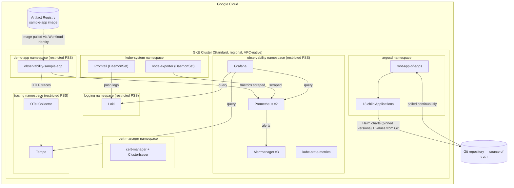

# Enterprise Observability Platform on Google Kubernetes Engine

**Implementation Guide** — architecture, deployment, monitoring configuration, and operations,
for a production-shaped observability platform (metrics, logs, traces, dashboards, alerting) on
GKE, delivered through GitOps.

**Audience:** DevOps / Platform / SRE engineers operating or extending this platform.
**Scope:** complete lifecycle — cluster planning through day-to-day operations and troubleshooting.

---

## Table of Contents

1. [Solution Overview](#1-solution-overview)
2. [Google Kubernetes Engine Fundamentals](#2-google-kubernetes-engine-fundamentals)
3. [GKE Cluster Planning](#3-gke-cluster-planning)
4. [Creating the GKE Cluster](#4-creating-the-gke-cluster)
5. [GKE Resources Used in This Implementation](#5-gke-resources-used-in-this-implementation)
6. [Repository Structure](#6-repository-structure)
7. [Application Deployment Flow](#7-application-deployment-flow)
8. [Helm Deployment](#8-helm-deployment)
9. [Kubernetes Deployment Detail](#9-kubernetes-deployment-detail)
10. [Observability Architecture](#10-observability-architecture)
11. [Prometheus Implementation](#11-prometheus-implementation)
12. [Grafana Implementation](#12-grafana-implementation)
13. [Day-to-Day GKE Operations](#13-day-to-day-gke-operations)
14. [CLI Reference](#14-cli-reference)
15. [Troubleshooting Guide](#15-troubleshooting-guide)
16. [Best Practices](#16-best-practices)
17. [Complete Deployment Workflow](#17-complete-deployment-workflow)
18. [Appendix](#18-appendix)

---

## 1. Solution Overview

### 1.1 Project Overview

This platform provides full-stack observability — **metrics, logs, and distributed traces** —
for workloads running on Google Kubernetes Engine, unified in Grafana and backed by automated
alerting. Every cluster resource is declared in Git and reconciled continuously by ArgoCD, so the
Git history of this repository is the authoritative change history of the cluster: there is no
class of production change that happens outside version control.

A reference workload (`observability-sample-app`, an instrumented ASP.NET Core service) is
deployed alongside the platform to prove the pipeline against real traffic rather than
synthetic checks.

### 1.2 Objectives

- Deploy a highly-available metrics, logging, and tracing stack on GKE.
- Manage 100% of cluster state through GitOps (ArgoCD) — no manual `kubectl apply` of workload
  state.
- Enforce an enterprise security baseline: namespace multi-tenancy, least-privilege RBAC,
  default-deny NetworkPolicy, restricted Pod Security Standards.
- Provide dashboards and alert rules as version-controlled code, not manual Grafana/Alertmanager
  UI configuration.
- Prove cross-pillar correlation — one request, traceable through metrics, logs, and traces
  simultaneously.

### 1.3 Scope

**In scope:** cluster architecture, GitOps delivery, metrics/logs/traces stack, dashboards,
alerting, RBAC, network segmentation, Helm packaging, day-2 operations.

**Out of scope (see [§18.1](#181-useful-links) for where to take these further):** identity
federation to a live corporate IdP (the RBAC layer is IdP-ready but not bound to one),
production-scale long-term metrics/log/trace retention tuning, and a CI pipeline for this
repository itself.

### 1.4 Architecture Overview



### 1.5 High-Level Workflow

```
Git commit (manifest / Application / values change)
        │
        ▼
ArgoCD detects drift (poll + webhook)
        │
        ▼
ArgoCD renders Helm charts / applies manifests
        │
        ▼
GKE API server schedules/updates resources
        │
        ▼
Prometheus discovers new/changed targets automatically (ServiceMonitor)
        │
        ▼
Grafana dashboards and Alertmanager rules reflect the new state
        │
        ▼
selfHeal continuously reconciles — any out-of-band change is reverted
```

### 1.6 Repository Structure

```
.
├── bootstrap/            # ArgoCD installation + the root App-of-Apps Application
├── argocd-apps/          # One ArgoCD Application manifest per platform component (14 total)
├── manifests/            # Desired-state Kubernetes YAML each Application reconciles
│   ├── namespaces/           namespace + ResourceQuota + LimitRange, per tenant
│   ├── rbac/                 least-privilege Role/RoleBinding, bound to Groups
│   ├── network-policies/     default-deny + explicit allow NetworkPolicies
│   ├── security/              ClusterIssuer and related security objects
│   ├── cert-manager/          cert-manager install
│   ├── kube-prometheus-stack/ Prometheus/Grafana/Alertmanager Helm values
│   ├── loki/                  Loki + Promtail Helm values
│   ├── tempo/                 Tempo + OTel Collector Helm values
│   ├── sample-app/            reference workload Deployment/Service
│   ├── dashboards/            Grafana dashboard JSON + Kustomize wrapper
│   └── alert-rules/           PrometheusRule definitions (node health, crash-loops, SLO)
├── charts/                # Distributable Helm chart packaging of the same stack
│   └── observability-gke/    GKE-native chart: kube-prometheus-stack + Loki + Tempo + OTel
├── scripts/               # Cluster bootstrap and end-to-end validation automation
├── docs/                  # Architecture and operational reference documentation
└── observability-sample-app/  (separate repository) instrumented reference workload
```

### 1.7 Technology Stack

| Layer | Technology | Version |
|---|---|---|
| Managed Kubernetes | Google Kubernetes Engine (Standard) | 1.35.x (Stable release channel) |
| GitOps controller | ArgoCD | 3.4.5 |
| Package manager | Helm | 4.1.4 |
| Metrics | Prometheus (via kube-prometheus-stack) | chart 87.15.2 |
| Alerting | Alertmanager | chart 87.15.2 (bundled) |
| Dashboards | Grafana | chart 87.15.2 (bundled) |
| Logs | Grafana Loki + Promtail | chart 7.0.0 / 6.17.1 |
| Traces | Grafana Tempo + OpenTelemetry Collector | chart 1.24.4 / 0.165.0 |
| Reference workload | ASP.NET Core (.NET 10), OpenTelemetry-instrumented | — |
| Image registry | Artifact Registry | — |
| Identity | Workload Identity Federation for GKE | — |
| Networking | VPC-native (alias IPs), Dataplane V2 (NetworkPolicy enforcement) | — |

---

## 2. Google Kubernetes Engine Fundamentals

DevOps-relevant essentials only — this is not a general Kubernetes tutorial.

| Concept | What it is | Relevance to this platform |
|---|---|---|
| **Control plane** | Google-managed API server, scheduler, controller-manager, etcd — no node access, no maintenance burden | We consume the API server endpoint only; GKE upgrades/patches it per the cluster's release channel |
| **Worker nodes** | VMs (Compute Engine instances) that run pods, grouped into node pools | Sized `e2-standard-4`, 3+ nodes, for this platform's steady-state footprint |
| **Node pools** | A group of nodes sharing a machine type/config; a cluster can have multiple | Single general-purpose pool by default; a dedicated pool is an option for metrics/logging-heavy workloads at larger scale |
| **Workloads** | The umbrella term for anything scheduled onto nodes (Deployments, StatefulSets, DaemonSets, Jobs) | Every platform component is a workload reconciled by ArgoCD |
| **Pods** | Smallest deployable unit — one or more containers sharing network/storage | Every container in this platform (Prometheus, Grafana, the sample app, …) runs inside a pod |
| **ReplicaSets** | Ensures N identical pod replicas are running; normally managed indirectly via a Deployment | Underlies every Deployment in this platform |
| **Deployments** | Declarative, rolling-update-capable management of stateless ReplicaSets | Grafana, the sample app, OTel Collector |
| **StatefulSets** | Like a Deployment but with stable network identity and per-replica persistent storage | Prometheus, Alertmanager, Loki, Tempo |
| **Services** | Stable virtual IP + DNS name load-balancing across matching pods | Every component is reached by its Service DNS name, never a pod IP |
| **Ingress** | L7 HTTP(S) routing; on GKE, provisions a real Cloud Load Balancer | Used to expose Grafana/ArgoCD externally (Section 9) |
| **Storage (PV/PVC/StorageClass)** | Dynamic block storage provisioning backed by Google Persistent Disk | Backs Prometheus/Alertmanager/Grafana/Loki/Tempo state |
| **Networking (VPC-native)** | Pods get real VPC-routable IP addresses (alias IP ranges), required for Dataplane V2 | Required for the platform's NetworkPolicy enforcement to have any effect |
| **IAM** | Google Cloud's identity/permission system, cluster-external | Controls who can administer the GKE cluster itself and its supporting GCP resources |
| **Service Accounts (GCP + Kubernetes)** | GCP service accounts hold cloud permissions; Kubernetes ServiceAccounts identify in-cluster workloads; Workload Identity binds the two | Used so pods (Loki, Tempo, the sample app's image pull) authenticate to GCP APIs without any long-lived key stored as a Kubernetes Secret |

---

## 3. GKE Cluster Planning

### 3.1 Prerequisites

| Item | Requirement |
|---|---|
| Google Cloud project | Dedicated project (or a dedicated environment within a shared project), billing enabled |
| Billing account | Linked and active before any API can be enabled |
| Local tooling | `gcloud`, `kubectl`, `helm` (v3.14+), `argocd` CLI |
| IAM permissions (operator) | `roles/container.admin`, `roles/iam.serviceAccountAdmin`, `roles/compute.networkAdmin` (or project Owner/Editor for initial setup) |

### 3.2 Required Google Cloud APIs

```bash
gcloud services enable \
  container.googleapis.com \
  compute.googleapis.com \
  iam.googleapis.com \
  artifactregistry.googleapis.com \
  cloudresourcemanager.googleapis.com
```

### 3.3 IAM Roles

| Role | Bound to | Purpose |
|---|---|---|
| `roles/container.admin` | Platform operators | Full cluster and workload administration |
| `roles/container.developer` | CI/CD service accounts | Deploy workloads, cannot modify cluster infrastructure |
| `roles/iam.workloadIdentityUser` | Per-workload GCP service accounts (Loki, Tempo, sample-app) | Lets a Kubernetes ServiceAccount impersonate a GCP service account — see [§9.6](#96-workload-identity-bindings) |
| `roles/artifactregistry.reader` | The GKE node service account | Pull container images |

### 3.4 Authentication

```bash
gcloud auth login
gcloud config set project <project-id>
gcloud container clusters get-credentials observability-platform --region <region>
```

### 3.5 Networking Plan

| Item | Value used |
|---|---|
| Mode | VPC-native (alias IP ranges) — required for Dataplane V2 NetworkPolicy enforcement |
| Subnet | Dedicated subnet per environment, custom-mode VPC |
| Pod IP range | `/17` secondary range (plenty of headroom for pod density) |
| Service IP range | `/22` secondary range |
| Firewall | Default GKE-managed rules for node-to-control-plane; NetworkPolicy (Section 9) governs pod-to-pod, not VPC firewall rules |

### 3.6 Node and Cluster Sizing

| Parameter | Value | Rationale |
|---|---|---|
| Machine type | `e2-standard-4` (4 vCPU / 16GB) | Comfortably fits 2x Prometheus + 3x Alertmanager + Grafana + Loki + Tempo + OTel Collector with headroom for scheduler churn and Helm hook Jobs |
| Node count | 3 (regional cluster — one per zone) | Spreads StatefulSet replicas across zones for real HA |
| Autoscaling | Cluster Autoscaler enabled, min 3 / max 6 | Absorbs transient load (Helm upgrade hook Jobs, HPA scale-out) without manual intervention |
| Regional vs Zonal | **Regional** | Control plane replicated across 3 zones — no single-zone control-plane outage risk; required for the Alertmanager 3-replica/Prometheus 2-replica anti-affinity to provide genuine HA |
| Private vs Public cluster | **Private nodes**, public control-plane endpoint restricted by authorized networks | Nodes have no public IPs; administrative access is via `gcloud`/`kubectl` from authorized CIDR ranges or Cloud Shell |
| Release channel | **Stable** | Matches the platform's "pin everything, nothing floating" principle (Section 1) — predictable, tested GKE/Kubernetes versions only |
| Maintenance window | Off-peak daily window, `maintenance-exclusion` applied around planned load-testing windows | Avoids node upgrades mid-validation |
| Node image | `COS_CONTAINERD` (Container-Optimized OS with containerd) | GKE default, smallest attack surface, fastest boot |

---

## 4. Creating the GKE Cluster

### 4.1 Using Cloud Console

1. Navigate to **Kubernetes Engine → Clusters → Create**.
2. Choose **Standard** cluster mode (not Autopilot — see [§16.9](#169-standard-vs-autopilot)).
3. Set **Name**: `observability-platform`; **Location type**: Regional; select the target region.
4. Under **Node Pools**, set machine type `e2-standard-4`, enable autoscaling (min 3, max 6).
5. Under **Networking**, select the VPC-native subnet, enable **Dataplane V2**.
6. Under **Security**, enable **Workload Identity**.
7. Under **Cluster → Release channel**, select **Stable**.
8. Review and **Create** — provisioning takes several minutes.

### 4.2 Using gcloud CLI

```bash
gcloud container clusters create observability-platform \
  --region=<region> \
  --release-channel=stable \
  --enable-ip-alias \
  --enable-dataplane-v2 \
  --workload-pool=<project-id>.svc.id.goog \
  --num-nodes=3 \
  --machine-type=e2-standard-4 \
  --enable-autoscaling --min-nodes=3 --max-nodes=6 \
  --enable-private-nodes \
  --master-authorized-networks=<admin-cidr>
```

### 4.3 Using Terraform

```hcl
resource "google_container_cluster" "observability" {
  name     = "observability-platform"
  location = var.region

  release_channel { channel = "STABLE" }

  networking_mode = "VPC_NATIVE"
  datapath_provider = "ADVANCED_DATAPATH"   # Dataplane V2

  workload_identity_config {
    workload_pool = "${var.project_id}.svc.id.goog"
  }

  private_cluster_config {
    enable_private_nodes = true
    master_ipv4_cidr_block = "172.16.0.0/28"
  }

  ip_allocation_policy {}   # required for VPC-native, ranges auto-assigned

  remove_default_node_pool = true
  initial_node_count       = 1
}

resource "google_container_node_pool" "primary" {
  name     = "primary-pool"
  cluster  = google_container_cluster.observability.name
  location = var.region

  autoscaling { min_node_count = 3, max_node_count = 6 }

  node_config {
    machine_type = "e2-standard-4"
    oauth_scopes = ["https://www.googleapis.com/auth/cloud-platform"]
  }
}
```

### 4.4 Infrastructure-as-Code Best Practices

- State stored remotely (GCS backend with versioning), never local `.tfstate`.
- Cluster infra (Terraform) and cluster **content** (ArgoCD-managed Git) are two separate
  concerns with two separate change processes — Terraform provisions the cluster once;
  everything running inside it is GitOps-managed from that point on (Section 8-9).
- Plan-then-apply in CI, never `terraform apply` from a laptop against a shared environment.

### 4.5 When to Use Each Method

| Method | Use when |
|---|---|
| Cloud Console | One-off exploration, learning, emergency manual intervention |
| gcloud CLI | Scripted, repeatable single-cluster provisioning; fastest path to a working cluster |
| Terraform | Any real environment — the only method that gives a reviewable diff before a change is applied and a durable record of the cluster's configuration |

---

## 5. GKE Resources Used in This Implementation

| Resource | Used for | Where |
|---|---|---|
| **Namespaces** | Tenant isolation boundary — one per concern | `argocd`, `cert-manager`, `observability`, `logging`, `tracing`, `demo-app`, `kube-system` |
| **Node Pools / Nodes** | Compute for all workloads | Single `primary-pool`, `e2-standard-4` x3-6 |
| **Deployments** | Stateless components | Grafana, OTel Collector, sample-app, ArgoCD components |
| **StatefulSets** | Components needing stable identity/storage | Prometheus, Alertmanager, Loki, Tempo |
| **DaemonSets** | Node-local agents | node-exporter, Promtail (both in `kube-system`) |
| **Jobs** | One-shot tasks | Helm chart admission-webhook cert-generation hooks |
| **CronJobs** | *(not currently used)* | Reserved for future scheduled maintenance tasks |
| **Services** | Stable in-cluster addressing | One per component (ClusterIP) |
| **Ingress** | External HTTP(S) access | Grafana, ArgoCD UI (Section 9) |
| **PersistentVolumes / Claims** | Durable state | Prometheus TSDB, Alertmanager, Grafana DB, Loki chunks, Tempo blocks |
| **StorageClasses** | Provisioning profile | `standard-rwo` (pd-balanced, default) / `premium-rwo` (pd-ssd, high-IOPS option) |
| **ConfigMaps** | Non-secret configuration; also the Grafana dashboard delivery mechanism | Dashboard JSON, component configs |
| **Secrets** | Credentials | Grafana admin credential, any Workload Identity-adjacent config |
| **Horizontal Pod Autoscaler** | *(available, not enabled by default)* | Reserved for the sample app under variable load |
| **Vertical Pod Autoscaler** | *(available, recommendation-mode candidate)* | Right-sizing Prometheus/Loki/Tempo requests over time |
| **Cluster Autoscaler** | Node-level elasticity | Enabled, 3-6 nodes |
| **ResourceQuotas** | Per-namespace ceiling | One per tenant namespace |
| **LimitRanges** | Per-container default/min/max | One per tenant namespace |

---

## 6. Repository Structure

| Directory | Purpose |
|---|---|
| `bootstrap/` | ArgoCD installation manifest and the single root `Application` that bootstraps everything else |
| `argocd-apps/` | One ArgoCD `Application` per component — the GitOps control surface; adding a component means adding a file here |
| `manifests/namespaces/` | Namespace + ResourceQuota + LimitRange per tenant |
| `manifests/rbac/` | Role/RoleBinding definitions, bound to Groups |
| `manifests/network-policies/` | Default-deny + explicit allow NetworkPolicy objects |
| `manifests/security/`, `manifests/cert-manager/` | Certificate issuance |
| `manifests/kube-prometheus-stack/` | Prometheus/Grafana/Alertmanager Helm values |
| `manifests/loki/` | Loki + Promtail Helm values |
| `manifests/tempo/` | Tempo + OTel Collector Helm values |
| `manifests/sample-app/` | Reference workload Deployment/Service |
| `manifests/dashboards/` | Dashboard JSON + Kustomize `configMapGenerator` wrapper |
| `manifests/alert-rules/` | `PrometheusRule` definitions |
| `charts/observability-gke/` | Distributable Helm chart — the same stack, packaged for a single `helm install` |
| `scripts/` | Cluster bootstrap automation and the end-to-end validation gate |
| `docs/` | Architecture and operational documentation |
| `observability-sample-app/` *(separate repository)* | Application source code, Dockerfile, CI/CD workflow — deliberately kept out of the platform repository so application and platform change independently |

---

## 7. Application Deployment Flow

### 7.1 Build

The reference workload is an ASP.NET Core (.NET 10) service, built via a multi-stage `Dockerfile`
(SDK image for compilation only; runtime image is minimal). The final image runs as the base
image's built-in non-root user — no root container, anywhere in this platform.

### 7.2 Containerization

```dockerfile
FROM mcr.microsoft.com/dotnet/sdk:10.0 AS build
WORKDIR /src
COPY . .
RUN dotnet publish -c Release -o /app

FROM mcr.microsoft.com/dotnet/aspnet:10.0
WORKDIR /app
COPY --from=build /app .
USER $APP_UID
ENTRYPOINT ["dotnet", "SampleApp.dll"]
```

### 7.3 Image Registry — Artifact Registry

Images are pushed to a regional **Artifact Registry** Docker repository, tagged by immutable
commit SHA — never a floating tag:

```bash
gcloud artifacts repositories create observability \
  --repository-format=docker --location=<region>

# CI authenticates via Workload Identity Federation (google-github-actions/auth), no static key
docker push <region>-docker.pkg.dev/<project-id>/observability/observability-sample-app:sha-<commit>
```

The Deployment manifest pins this exact tag — what's running in the cluster always maps to one
inspectable source commit.

### 7.4 Deployment

Deployment happens exclusively through ArgoCD: the Deployment manifest's image tag is updated in
Git, committed, and pushed. ArgoCD detects the change and applies it — there is no direct
`kubectl set image` path in normal operation.

### 7.5 Helm Release / Rolling Update / Rollback

Platform components (Prometheus stack, Loki, Tempo) are Helm releases managed by ArgoCD.
A version bump is a one-line change to the pinned chart version in the relevant
`argocd-apps/*.yaml` source. ArgoCD performs the upgrade as a standard Kubernetes rolling update
(respecting each StatefulSet/Deployment's `updateStrategy`); rollback is `git revert` — ArgoCD
reconciles the cluster back to the previous chart version automatically.

### 7.6 Versioning

| What | Versioning approach |
|---|---|
| Application image | Immutable commit-SHA tag |
| Helm charts | Exact pinned version, recorded in `Chart.lock` |
| Kubernetes/GKE version | Pinned to a specific minor version via the Stable release channel |

### 7.7 Deployment Validation

Post-deploy validation runs against the live cluster (Section 15 has diagnostic commands):
ArgoCD Application health, pod readiness, and — for the sample app specifically — a live request
confirming a trace, log line, and metric increment all correlate for the same request
(Section 10.6).

---

## 8. Helm Deployment

### 8.1 Helm Architecture

Helm packages Kubernetes manifests as versioned, parameterized **charts**. This platform consumes
four upstream charts as pinned dependencies (`kube-prometheus-stack`, `loki`, `tempo`,
`opentelemetry-collector`) rather than re-implementing their templates, and layers a small chart
of its own (`charts/observability-gke/`) on top for dashboards and alert rules.

### 8.2 Chart Structure

```
charts/observability-gke/
├── Chart.yaml          # metadata + pinned subchart dependencies
├── Chart.lock           # resolved dependency versions (reproducible installs)
├── values.yaml           # this chart's configuration surface
├── values-gcs-backend.yaml   # opt-in overlay: GCS-backed Loki/Tempo storage
├── values-promtail.yaml      # values for the separate Promtail install
├── charts/               # downloaded subchart .tgz archives (helm dependency update)
├── dashboards/            # bundled dashboard JSON
└── templates/             # this chart's own templates (dashboards ConfigMap, alert rules, NOTES.txt)
```

### 8.3 `values.yaml`

Organized by subchart key (`kube-prometheus-stack:`, `loki:`, `tempo:`, `otel-collector:`), plus
this chart's own `dashboards:` and `alertRules:` keys. Every GKE-specific value —
`storageClassName: premium-rwo`, `serviceAccount.annotations` for Workload Identity, the Grafana
`ingress` block — is set here, not hardcoded in a template.

### 8.4 Templates and Helpers

This chart's own `templates/` directory contains only what the four subcharts don't already
provide: the dashboard ConfigMap (wrapping `dashboards/*.json`), the `PrometheusRule` alert
definitions, and a post-install `NOTES.txt`. All resource `metadata.namespace` fields resolve to
`.Release.Namespace` — a deliberate, validated choice (Section 16.1) so one `-n` flag controls the
entire release with no split-namespace risk.

### 8.5 Install / Upgrade / Rollback / Uninstall

```bash
# Install
cd charts/observability-gke
helm dependency update
helm install observability . -n observability --create-namespace

# Upgrade (after a values or version change)
helm upgrade observability . -n observability

# Rollback to the previous release
helm rollback observability -n observability

# Inspect release history
helm history observability -n observability

# Uninstall
helm uninstall observability -n observability
```

> **Note:** in normal operation, this platform's components are installed via ArgoCD's own Helm
> integration (Section 9), not by running `helm install` directly. The commands above apply to
> `charts/observability-gke` as a standalone distributable, e.g. for a downstream team consuming
> just the Helm chart without the full GitOps repository.

### 8.6 Version Management

Every chart dependency is pinned in `Chart.yaml` and locked in `Chart.lock`.
`helm dependency update` re-resolves against those pins — it never silently picks up a newer
version.

### 8.7 Common Commands

```bash
helm lint charts/observability-gke                 # static chart validation
helm template observability charts/observability-gke -n observability   # render without installing
helm show values grafana/tempo --version 1.24.4     # inspect a subchart's own defaults
helm list -A                                        # all releases, all namespaces
helm get values observability -n observability      # currently applied values for a release
```

---

## 9. Kubernetes Deployment Detail

### 9.1 Deployment Manifest — Reference Workload

```yaml
apiVersion: apps/v1
kind: Deployment
metadata:
  name: observability-sample-app
  namespace: demo-app
spec:
  replicas: 1
  selector:
    matchLabels: {app.kubernetes.io/name: observability-sample-app}
  template:
    metadata:
      labels: {app.kubernetes.io/name: observability-sample-app}
    spec:
      securityContext:
        runAsNonRoot: true
        runAsUser: 1654
        runAsGroup: 1654
        seccompProfile: {type: RuntimeDefault}
      containers:
        - name: sample-app
          image: <region>-docker.pkg.dev/<project-id>/observability/observability-sample-app:sha-<commit>
          ports: [{containerPort: 8080, name: http}]
          env:
            - {name: OTEL_SERVICE_NAME, value: observability-sample-app}
            - {name: OTEL_EXPORTER_OTLP_ENDPOINT, value: "http://otel-collector-opentelemetry-collector.tracing.svc.cluster.local:4317"}
          securityContext:
            allowPrivilegeEscalation: false
            readOnlyRootFilesystem: true
            capabilities: {drop: ["ALL"]}
          resources:
            requests: {cpu: 100m, memory: 128Mi}
            limits: {cpu: 250m, memory: 256Mi}
          livenessProbe:  {httpGet: {path: /healthz, port: http}, initialDelaySeconds: 5, periodSeconds: 10}
          readinessProbe: {httpGet: {path: /healthz, port: http}, initialDelaySeconds: 5, periodSeconds: 10}
```

### 9.2 Services

Every component is addressed by its ClusterIP Service DNS name
(`<service>.<namespace>.svc.cluster.local`) — pods never hardcode another pod's IP. The OTLP
endpoint above is a concrete example: the sample app finds the collector purely by Service DNS.

### 9.3 ConfigMaps and Secrets

- **ConfigMaps** carry non-secret configuration and — via the Kustomize `configMapGenerator` in
  `manifests/dashboards/` — the Grafana dashboard JSON itself, labeled `grafana_dashboard: "1"` so
  Grafana's sidecar watcher picks it up automatically.
- **Secrets** carry the Grafana admin credential and any component credentials. No GCP key
  material is ever stored as a Kubernetes Secret — Workload Identity (§9.6) removes that need
  entirely for GCP API access.

### 9.4 Ingress

```yaml
ingress:
  enabled: true
  ingressClassName: gce
  annotations:
    kubernetes.io/ingress.class: "gce"
    networking.gke.io/managed-certificates: "grafana-cert"
  hosts:
    - grafana.<domain>
```

Disabled by default until a hostname and managed certificate are provisioned; the annotated block
above is staged and ready in `values.yaml`.

### 9.5 Resource Requests, Limits, and Probes

Every container in this platform declares explicit `requests`/`limits` — no component relies on
the namespace `LimitRange` default. **Best practice enforced throughout:** every value must sit
at or above the namespace `LimitRange`'s minimum floor (50m CPU / 64Mi memory in this
implementation); a value below that floor is rejected at admission, not silently clamped.
Liveness and readiness probes are defined on every long-running container, using an HTTP health
endpoint where the application exposes one (as above) or a TCP/exec probe otherwise.

### 9.6 Workload Identity Bindings

```bash
gcloud iam service-accounts create loki-gcs

gcloud projects add-iam-policy-binding <project-id> \
  --member="serviceAccount:loki-gcs@<project-id>.iam.gserviceaccount.com" \
  --role="roles/storage.objectAdmin"

gcloud iam service-accounts add-iam-policy-binding loki-gcs@<project-id>.iam.gserviceaccount.com \
  --role roles/iam.workloadIdentityUser \
  --member "serviceAccount:<project-id>.svc.id.goog[logging/loki]"
```
```yaml
apiVersion: v1
kind: ServiceAccount
metadata:
  name: loki
  namespace: logging
  annotations:
    iam.gke.io/gcp-service-account: loki-gcs@<project-id>.iam.gserviceaccount.com
```

### 9.7 Rolling Update Strategy

StatefulSets (Prometheus, Alertmanager, Loki, Tempo) use `RollingUpdate` with `partition: 0`
(default) — one replica at a time, waiting for readiness before proceeding. Deployments
(Grafana, sample-app, OTel Collector) use the standard `maxUnavailable: 25%, maxSurge: 25%`
rolling update.

---

## 10. Observability Architecture

### 10.1 Pipeline Overview

```
 Application (sample-app)
      │  /metrics            │  OTLP traces           │  stdout (JSON, trace-enriched)
      ▼                       ▼                         ▼
 Prometheus            OTel Collector              node-level log agent
 (scrape, 2 replicas)        │                      (Promtail DaemonSet)
      │                      ▼                            │
      │                    Tempo                          ▼
      │                (trace storage)                   Loki
      │                      │                       (log storage)
      └──────────────┬───────┴───────────────┬────────────┘
                      ▼                       ▼
                   Grafana  ◄───────────  Alertmanager
              (dashboards, unified query)  (3 replicas, routes firing alerts)
```

### 10.2 Metrics Collection and Service Discovery

Prometheus uses **Kubernetes service discovery** via the Prometheus Operator's `ServiceMonitor`
and `PodMonitor` CRDs — a component becomes a scrape target by shipping a `ServiceMonitor` object
with a matching label selector, not by editing a central Prometheus config file. All in-cluster
components (kube-state-metrics, node-exporter, the sample app) are discovered this way.

### 10.3 Scraping and Storage

Scrape interval and retention are set per-environment in `manifests/kube-prometheus-stack/values.yaml`;
TSDB data is written to a `standard-rwo`-backed PersistentVolume per Prometheus replica.

### 10.4 Visualization and Alerting

Grafana holds pre-provisioned datasources for Prometheus, Loki, and Tempo (Section 12).
Alertmanager receives firing alerts evaluated by Prometheus against the `PrometheusRule` objects
in `manifests/alert-rules/` and routes them to configured receivers.

### 10.5 Data Flow Summary

| Pillar | Producer | Transport | Backend | Queried via |
|---|---|---|---|---|
| Metrics | Sample app `/metrics`, node-exporter, kube-state-metrics | Pull (scrape) | Prometheus TSDB | Grafana / PromQL |
| Logs | Every container's stdout | Push (Promtail tail → Loki API) | Loki chunks | Grafana / LogQL |
| Traces | Sample app OTLP export | Push (OTLP gRPC) | Tempo blocks | Grafana / TraceQL |

### 10.6 Cross-Pillar Correlation

The sample application enriches every log line with the active `TraceId`/`SpanId`
(`Activity.Current`), and exports the same identifiers as span attributes to Tempo. A single
request's trace ID therefore appears identically in Tempo (as the full multi-span trace), in Loki
(as a structured log field on every log line from that request), and drives a corresponding
Prometheus counter increment — giving an operator a single click-through path from a dashboard
panel, to the exact trace, to the exact log lines, for one real request.

---

## 11. Prometheus Implementation

### 11.1 Deployment

Deployed via the `kube-prometheus-stack` Helm chart, values in
`manifests/kube-prometheus-stack/values.yaml`. **2 replicas**, each with its own PVC-backed TSDB,
scheduled with pod anti-affinity across nodes/zones for real availability.

### 11.2 Service Discovery and Targets

All scrape targets are discovered via `ServiceMonitor`/`PodMonitor` CRDs — no static
`scrape_configs` maintained by hand. Current target set includes:

| Target | Discovered via |
|---|---|
| kube-state-metrics | Bundled `ServiceMonitor` |
| node-exporter | Bundled `ServiceMonitor` (DaemonSet, one target per node) |
| kube-proxy | Bundled `ServiceMonitor` |
| Prometheus itself, Alertmanager | Bundled self-monitoring `ServiceMonitor`s |
| observability-sample-app | Application-level `ServiceMonitor` pointing at `/metrics` |

### 11.3 Retention and Storage

TSDB retention is time- and size-bounded (configured in `values.yaml`), backed by a
`standard-rwo` PersistentVolume sized for that retention window. Longer retention needs a larger
PVC or an external long-term-storage integration (e.g., Thanos/Cortex) — not required at this
platform's current scale.

### 11.4 Recording Rules and Alert Rules

`PrometheusRule` objects, version-controlled in `manifests/alert-rules/`, organized into three
groups, all labeled `release: kube-prometheus-stack` so the Prometheus Operator picks them up:

| Group | Alert | Condition |
|---|---|---|
| `node-health` | `NodeHighCPUUsage`, `NodeHighMemoryUsage`, `NodeNotReady` | Node-level resource pressure / readiness |
| `pod-crashloops` | `PodCrashLooping` | `increase(kube_pod_container_status_restarts_total[15m]) > 3` for 2m |
| `sample-app-slo` | `SampleAppHighErrorRate`, `SampleAppCriticalErrorRate` | Single-window 5xx burn-rate against the sample app's request metrics |

### 11.5 Configuration Structure

```
manifests/kube-prometheus-stack/
└── values.yaml    # Prometheus replicas/resources/storage, Alertmanager replicas/resources,
                    # Grafana provisioning, all as one Helm values file consumed by the
                    # ArgoCD Application's multi-source (chart + this repo's values) config
```

---

## 12. Grafana Implementation

### 12.1 Deployment

Grafana is deployed as part of the `kube-prometheus-stack` release, with PVC-backed persistence
so dashboards, users, and datasource state survive pod restarts.

### 12.2 Data Sources

Pre-provisioned, not manually configured through the UI:

```yaml
grafana:
  additionalDataSources:
    - name: Loki
      type: loki
      url: http://loki.logging.svc.cluster.local:3100
    - name: Tempo
      type: tempo
      url: http://tempo.tracing.svc.cluster.local:3200
```
Prometheus is wired as the default datasource by the chart itself.

### 12.3 Authentication

Admin credential delivered via a Kubernetes Secret
(`kube-prometheus-stack-grafana`, key `admin-password`). Retrieve it without ever hardcoding the
value in a script or ticket:
```bash
kubectl get secret kube-prometheus-stack-grafana -n observability \
  -o jsonpath='{.data.admin-password}' | base64 -d; echo
```
> Production hardening: replace the chart-managed Secret with `admin.existingSecret` pointing at a
> Secret sourced from a real secrets manager, and layer OIDC/Google Workspace SSO on top for
> individual user accounts rather than shared `admin` access.

### 12.4 Provisioning and Folder Structure

Dashboards are **not** imported by hand through the UI. A Grafana sidecar container watches for
ConfigMaps labeled `grafana_dashboard: "1"` across the cluster and loads them automatically.
`manifests/dashboards/kustomization.yaml` generates that ConfigMap from a plain JSON file — the
dashboard's source of truth is the JSON file in Git, not Grafana's own database.

```yaml
# manifests/dashboards/kustomization.yaml
configMapGenerator:
  - name: grafana-dashboard-sample-app
    files: [sample-app-overview.json]
    options:
      labels: {grafana_dashboard: "1"}
```

### 12.5 Dashboard Management

To change a dashboard: edit the JSON in Grafana's UI, export it, overwrite the file in
`manifests/dashboards/`, commit, push. ArgoCD updates the ConfigMap, and Grafana's sidecar reloads
it within its configured poll interval — no manual re-import step, ever.

---

## 13. Day-to-Day GKE Operations

```bash
# Clusters
gcloud container clusters list
gcloud container clusters describe observability-platform --region <region>

# Node pools / nodes
gcloud container node-pools list --cluster observability-platform --region <region>
kubectl get nodes -o wide
kubectl top nodes

# Workloads
kubectl get deployments,statefulsets,daemonsets -A
kubectl get pods -A -o wide
kubectl get svc -A
kubectl get ingress -A

# Logs
kubectl logs -n observability deploy/kube-prometheus-stack-grafana -f
kubectl logs -n tracing tempo-0 --previous     # previous container instance, e.g. after a crash

# Describe / diagnose
kubectl describe pod <pod> -n <namespace>
kubectl get events -n <namespace> --sort-by=.lastTimestamp

# Port-forward (ad-hoc local access)
kubectl port-forward -n observability svc/kube-prometheus-stack-grafana 3000:80

# Scaling
kubectl scale deployment/<name> -n <namespace> --replicas=3

# Restart / roll a Deployment
kubectl rollout restart deployment/<name> -n <namespace>
kubectl rollout status deployment/<name> -n <namespace>
kubectl rollout undo deployment/<name> -n <namespace>

# Delete a stuck pod (its controller recreates it)
kubectl delete pod <pod> -n <namespace>

# Namespaces
kubectl get namespace
kubectl describe namespace <namespace>       # includes ResourceQuota/LimitRange usage

# Secrets / ConfigMaps
kubectl get secrets -n <namespace>
kubectl get configmaps -n <namespace>

# Storage
kubectl get pvc -A
kubectl get pv
kubectl get storageclass

# Exec / copy
kubectl exec -it <pod> -n <namespace> -- sh
kubectl cp <namespace>/<pod>:/path/in/pod ./local-path

# Resource usage
kubectl top pods -n <namespace>
```

---

## 14. CLI Reference

### 14.1 gcloud

| Command | Purpose |
|---|---|
| `gcloud container clusters get-credentials <name> --region <region>` | Configure `kubectl` for the cluster |
| `gcloud container clusters describe <name> --region <region>` | Cluster configuration and status |
| `gcloud container node-pools list --cluster <name> --region <region>` | List node pools |
| `gcloud container clusters update <name> --region <region> --enable-autoscaling` | Adjust autoscaling |
| `gcloud iam service-accounts list` | List GCP service accounts |
| `gcloud artifacts repositories list` | List Artifact Registry repositories |
| `gcloud logging read` | Query Cloud Logging directly (control-plane/audit logs) |

### 14.2 kubectl

| Command | Purpose |
|---|---|
| `kubectl get applications -n argocd` | ArgoCD Application sync/health status |
| `kubectl get pods -A` | All pods, all namespaces |
| `kubectl describe <kind> <name> -n <ns>` | Full object detail, including recent Events |
| `kubectl logs <pod> -n <ns> [-c container] [-f]` | Container logs |
| `kubectl exec -it <pod> -n <ns> -- sh` | Interactive shell in a container |
| `kubectl top pods / nodes` | Live resource usage (requires metrics-server, GKE-bundled) |
| `kubectl auth can-i <verb> <resource> -n <ns> --as=<user> --as-group=<group>` | RBAC verification |
| `kubectl get networkpolicy -n <ns>` | NetworkPolicy inventory |

### 14.3 helm

| Command | Purpose |
|---|---|
| `helm list -A` | All releases, all namespaces |
| `helm status <release> -n <ns>` | Release status and notes |
| `helm get values <release> -n <ns>` | Currently applied values |
| `helm diff upgrade <release> <chart> -f values.yaml` | Preview an upgrade's diff (requires `helm-diff` plugin) |
| `helm rollback <release> <revision> -n <ns>` | Roll back to a prior release revision |

---

## 15. Troubleshooting Guide

| Symptom | Likely cause | Diagnosis | Fix |
|---|---|---|---|
| **Pod stuck `Pending`** | Insufficient node capacity, or unschedulable constraints | `kubectl describe pod` → check `Events` for `FailedScheduling` | Scale the node pool / cluster autoscaler headroom, or relax anti-affinity/resource requests |
| **`CrashLoopBackOff`** | Application error, misconfiguration, or missing dependency at startup | `kubectl logs <pod> --previous`, `kubectl describe pod` | Fix the underlying error; verify the fix is applied via Git commit, not a live patch (self-heal will revert an unpushed live edit) |
| **`ImagePullBackOff`** | Wrong image tag/registry path, or missing pull authorization | `kubectl describe pod` → check the exact error message | Confirm the Artifact Registry path and tag are correct; confirm the node/pod's identity has `roles/artifactregistry.reader` |
| **`OOMKilled` (exit 137)** | Container memory limit set below real usage, especially after WAL/state replay on restart | `kubectl describe pod` → `Last State: Terminated, Reason: OOMKilled`; check the container's `resources.limits.memory` | Raise the container's memory limit **and** the namespace `LimitRange`/`ResourceQuota` ceiling together; verify the fix is set at the correct key path for the chart in use — some upstream charts nest `resources` under a component-specific key rather than a top-level one, so confirm with `helm show values <chart>` before assuming a values change took effect |
| **PVC stuck `Pending`** | No matching StorageClass, or zone mismatch for a zonal disk | `kubectl describe pvc` | Confirm `storageClassName` matches an existing StorageClass; for regional clusters prefer a StorageClass with cross-zone-compatible provisioning |
| **Service discovery / DNS failures** | CoreDNS pressure, or NetworkPolicy blocking DNS egress | `kubectl exec <pod> -- nslookup <service>.<ns>.svc.cluster.local` | Confirm a NetworkPolicy allow rule exists for DNS (UDP/TCP 53) egress from the affected namespace |
| **Ingress not provisioning a Load Balancer** | Missing/incorrect `ingressClassName`, or no ready backend | `kubectl describe ingress`, check GCE Ingress controller events | Confirm `ingressClassName: gce` and a healthy backend Service/Endpoints |
| **Node failures / `NotReady`** | VM-level issue, or kubelet unresponsive | `kubectl get nodes`, `kubectl describe node <node>` | GKE typically auto-repairs (if node auto-repair is enabled); for persistent issues, cordon/drain and let Cluster Autoscaler replace the node |
| **Scheduling issues (anti-affinity can't be satisfied)** | Too few nodes/zones for the requested spread | `kubectl describe pod` → `Events` | Increase node pool size, or relax `podAntiAffinity` from `requiredDuringScheduling` to `preferredDuringScheduling` |
| **Prometheus target `down`** | NetworkPolicy blocking scrape traffic, or the target's port/path misconfigured in its `ServiceMonitor` | Prometheus UI → **Status → Targets**, check the `lastError` | Confirm NetworkPolicy allows ingress from the `observability` namespace to the target's port; confirm the `ServiceMonitor`'s port name matches the Service's port name |
| **Grafana dashboard not appearing** | ConfigMap missing the `grafana_dashboard: "1"` label, or the sidecar hasn't polled yet | `kubectl get configmap -n observability -l grafana_dashboard=1` | Confirm the label is present; check the Grafana sidecar container's own logs for reload errors |
| **Storage / disk pressure** | PVC undersized for real retention/cardinality growth | `kubectl exec <pod> -- df -h` | Resize the PVC (if the StorageClass supports online expansion) or reduce retention |
| **RBAC `Forbidden` errors** | Persona correctly denied (working as designed) or bound to the wrong Group | `kubectl auth can-i <verb> <resource> --as=<user> --as-group=<group>` | Confirm intended behavior first — this platform's `sre-viewer`/`observability-admin` split is deliberately restrictive; only broaden a Role if the denial is genuinely unintended |

---

## 16. Best Practices

| Area | Practice applied in this implementation |
|---|---|
| **Naming conventions** | `<component>-<role>` (e.g., `kube-prometheus-stack-grafana`); Helm release name matches chart name unless multiple releases coexist |
| **Namespaces** | One per tenant/concern (`observability`, `logging`, `tracing`, `demo-app`), never a shared catch-all namespace for unrelated workloads |
| **Labels** | `app.kubernetes.io/name`, `app.kubernetes.io/instance` on every resource — the Kubernetes-recommended label set, consistently applied |
| **Annotations** | Reserved for tooling metadata (Workload Identity bindings, ArgoCD tracking) — never used to carry data an application needs at runtime |
| **Secrets management** | Kubernetes Secrets for in-cluster credentials only; GCP API access uses Workload Identity, never a downloaded key file |
| **Resource limits** | Every container sets explicit `requests`/`limits`, at or above the namespace `LimitRange` floor |
| **Monitoring** | Every component ships its own `ServiceMonitor`; no manually-maintained central scrape config |
| **Logging** | One logging path per container (stdout, tailed by Promtail) — never a parallel/duplicate log-shipping mechanism |
| **High availability** | Odd-numbered replica counts for gossip/quorum components (Alertmanager: 3); anti-affinity spreading replicas across zones |
| **Security** | Restricted Pod Security Standard on every tenant namespace; default-deny NetworkPolicy with explicit allows; least-privilege RBAC bound to Groups, not individuals |
| **Backup** | PVC snapshots (Google Persistent Disk snapshot schedules) for stateful components; platform *configuration* itself needs no backup — it's reconstructible from Git at any time |
| **Helm** | Pin every chart version; never install against a floating `latest`/unpinned dependency |
| **Versioning** | Immutable image tags (commit SHA) everywhere; no `:latest` in any manifest |
| **Deployment strategy** | Rolling updates by default; GitOps-mediated so every change is reviewable before it reaches the cluster |
| **Scaling** | Cluster Autoscaler for node elasticity; HPA reserved for workloads with variable load (not yet required for this platform's own components) |

### 16.9 Standard vs Autopilot

This implementation targets **GKE Standard**, a deliberate choice: two components
(node-exporter and Promtail) require `hostNetwork`/`hostPID`/`hostPath` access that **GKE
Autopilot does not permit**. On Autopilot, the natural substitutes are **Google Cloud Managed
Service for Prometheus** (node-level metrics without a self-managed node-exporter DaemonSet) and
**Cloud Logging's built-in log router** (no self-managed Promtail DaemonSet needed) — both
Google-managed, zero-maintenance alternatives, at the cost of operating less of the stack
yourself. Standard was chosen here specifically to retain full control over the Prometheus/Loki
configuration and alerting behavior.

---

## 17. Complete Deployment Workflow

```
Create GCP Project
        │
        ▼
Enable Required APIs (container, compute, iam, artifactregistry)
        │
        ▼
Create VPC + Subnet (VPC-native, secondary ranges for pods/services)
        │
        ▼
Create GKE Cluster (Standard, regional, Workload Identity, Dataplane V2)
        │
        ▼
Configure kubectl (gcloud container clusters get-credentials)
        │
        ▼
Install ArgoCD + Apply Root App-of-Apps Application
        │
        ▼
ArgoCD Reconciles: Namespaces → RBAC → NetworkPolicy → cert-manager
        │
        ▼
ArgoCD Reconciles: kube-prometheus-stack (Prometheus, Alertmanager, Grafana)
        │
        ▼
ArgoCD Reconciles: Loki + Promtail
        │
        ▼
ArgoCD Reconciles: Tempo + OTel Collector
        │
        ▼
ArgoCD Reconciles: Dashboards + Alert Rules (as code)
        │
        ▼
ArgoCD Reconciles: Reference Application (observability-sample-app)
        │
        ▼
Verify: All ArgoCD Applications Synced + Healthy
        │
        ▼
Verify: Prometheus Targets Healthy, Loki Ingesting, Tempo Receiving Spans
        │
        ▼
Access Dashboards (Grafana) — confirm metrics/logs/traces correlate
        │
        ▼
Production-Ready Observability Platform
```

---

## 18. Appendix

### 18.1 Useful Links

| Resource | URL |
|---|---|
| GKE documentation | https://cloud.google.com/kubernetes-engine/docs |
| Workload Identity | https://cloud.google.com/kubernetes-engine/docs/how-to/workload-identity |
| ArgoCD documentation | https://argo-cd.readthedocs.io |
| Prometheus Operator CRDs | https://prometheus-operator.dev |
| Grafana provisioning | https://grafana.com/docs/grafana/latest/administration/provisioning/ |
| OpenTelemetry | https://opentelemetry.io/docs |

### 18.2 CLI Cheat Sheet

See Section 14 for the full categorized reference.

### 18.3 Directory Reference

See Section 6.

### 18.4 Resource Summary

| Category | Count |
|---|---|
| ArgoCD-managed Applications | 14 |
| Tenant namespaces | 4 (`observability`, `logging`, `tracing`, `demo-app`) |
| Platform namespaces | 3 (`argocd`, `cert-manager`, `kube-system`) |
| Prometheus replicas | 2 |
| Alertmanager replicas | 3 |
| PrometheusRule alert groups | 3 (node-health, pod-crashloops, sample-app-slo) |
| Pinned Helm chart dependencies | 5 (kube-prometheus-stack, loki, promtail, tempo, opentelemetry-collector) |

### 18.5 Common Ports

| Port | Component |
|---|---|
| 3000 | Grafana |
| 9090 | Prometheus |
| 9093 | Alertmanager |
| 3100 | Loki |
| 3200 | Tempo (HTTP query) |
| 4317 / 4318 | OTel Collector (OTLP gRPC / HTTP) |
| 443 | ArgoCD server (HTTPS) |

### 18.6 Common Kubernetes Objects Reference

`Namespace`, `ResourceQuota`, `LimitRange`, `Role`/`RoleBinding`, `NetworkPolicy`, `Deployment`,
`StatefulSet`, `DaemonSet`, `Service`, `Ingress`, `PersistentVolumeClaim`, `StorageClass`,
`ConfigMap`, `Secret`, `ServiceAccount`, `ServiceMonitor`, `PrometheusRule`.

### 18.7 Glossary

| Term | Meaning |
|---|---|
| GitOps | Operating model where Git is the single source of truth for desired cluster state, continuously reconciled by a controller |
| App-of-Apps | An ArgoCD pattern where one root Application manages a set of child Applications |
| Self-heal | ArgoCD behavior that automatically reverts live cluster state not matching the last-synced Git commit |
| OTLP | OpenTelemetry Protocol — vendor-neutral wire format for exporting traces/metrics/logs |
| Pod Security Standards | Kubernetes-native policy levels (privileged, baseline, restricted) enforced via namespace labels |
| SLO burn-rate alert | An alert based on the rate of error-budget consumption rather than a single static threshold |
| Workload Identity | GKE mechanism allowing a Kubernetes ServiceAccount to assume a GCP IAM identity without a stored key |
| Dataplane V2 | GKE's Cilium/Calico-based networking dataplane, required for NetworkPolicy enforcement |
| VPC-native cluster | A GKE cluster where pods and Services get real, routable VPC alias IPs |
