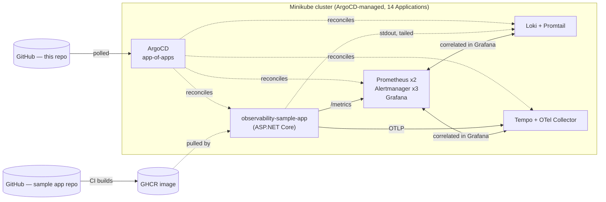

# Enterprise Observability & Monitoring on Kubernetes

A working, enterprise-shaped observability platform — metrics, logs, traces, dashboards, alert
rules, and a real instrumented workload proving it all works end-to-end — built hands-on on
Minikube with 100% of cluster state managed through ArgoCD, then documented and packaged as two
cloud-native Helm charts for GKE and EKS. This README is the single entry point; everything else
is linked from here.

## Architecture



Full diagram and component-by-component breakdown: [`docs/00-architecture.md`](docs/00-architecture.md).

## Documentation index

| Doc | What's in it |
|---|---|
| [`plan.md`](plan.md) *(local only, not in git — see below)* | The 18-phase implementation plan this whole project follows |
| [`docs/00-architecture.md`](docs/00-architecture.md) | Cross-cutting architecture, key decisions, repo map |
| [`docs/01-minikube-implementation.md`](docs/01-minikube-implementation.md) | Hands-on record — every phase, exact commands, real bugs found and fixed |
| [`docs/02-gke-documentation.md`](docs/02-gke-documentation.md) | Minikube → GKE translation, section-by-section |
| [`docs/03-eks-documentation.md`](docs/03-eks-documentation.md) | Minikube → EKS translation, section-by-section |
| [`docs/04-helm-charts.md`](docs/04-helm-charts.md) | Chart validation results, design decisions, values reference |
| [`charts/observability-gke/README.md`](charts/observability-gke/README.md) | GKE chart install guide |
| [`charts/observability-eks/README.md`](charts/observability-eks/README.md) | EKS chart install guide |
| [`observability-sample-app`](https://github.com/Siddharthasanapala/observability-sample-app) | The instrumented demo workload (separate repo) |

`plan.md` is intentionally not version-controlled (see `.gitignore`) — it's the local working
plan this implementation follows turn by turn; everything it specifies is captured in the docs
above once built.

## Reproduce on Minikube

```bash
scripts/01-setup-minikube.sh      # 4 CPU / 8192MB, Calico CNI, dynamic PVC provisioning
scripts/02-bootstrap-argocd.sh    # installs ArgoCD, applies the App-of-Apps root Application
# push this repo to your own GitHub remote, update bootstrap/root-app.yaml's repoURL,
# then everything else (namespaces, RBAC, NetworkPolicy, metrics/logs/traces, dashboards,
# alert rules) reconciles automatically from argocd-apps/ — see docs/01-minikube-implementation.md
scripts/validate.sh               # 26-check end-to-end validation gate
```

Full walkthrough with every decision explained: [`docs/01-minikube-implementation.md`](docs/01-minikube-implementation.md).

## Install on GKE

```bash
gcloud container clusters create observability-platform \
  --region=<region> --enable-ip-alias --release-channel=stable \
  --num-nodes=3 --machine-type=e2-standard-4 --workload-pool=<project-id>.svc.id.goog

cd charts/observability-gke
helm dependency update
helm install observability . -n observability --create-namespace
```

Full prerequisites, Standard-vs-Autopilot tradeoffs, Workload Identity setup, and the GCS
storage overlay: [`charts/observability-gke/README.md`](charts/observability-gke/README.md) and
[`docs/02-gke-documentation.md`](docs/02-gke-documentation.md).

## Install on EKS

```bash
eksctl create cluster \
  --name observability-platform --region <region> --version 1.31 \
  --nodegroup-name standard-workers --node-type m5.xlarge --nodes 3 --with-oidc

cd charts/observability-eks
helm dependency update
helm install observability . -n observability --create-namespace
```

Full prerequisites, managed-node-groups-vs-Fargate tradeoffs, IRSA setup, and the S3 storage
overlay: [`charts/observability-eks/README.md`](charts/observability-eks/README.md) and
[`docs/03-eks-documentation.md`](docs/03-eks-documentation.md).

## Requirements checklist

Every item from the original plan, checked off against the file(s) that satisfy it:

- [x] Minikube cluster running a full observability stack (metrics + logs + traces) —
      [`docs/01-minikube-implementation.md`](docs/01-minikube-implementation.md) §Phase 5-7,
      validated clean by [`scripts/validate.sh`](scripts/validate.sh) (26/26 checks).
- [x] 100% of cluster state deployed and changed only through ArgoCD, Git as source of truth —
      [`bootstrap/root-app.yaml`](bootstrap/root-app.yaml) + 13 child Applications in
      [`argocd-apps/`](argocd-apps/); the one documented exception (ArgoCD's own bootstrap) is
      explained in [`docs/01-minikube-implementation.md`](docs/01-minikube-implementation.md) §Phase 2.
- [x] Enterprise baseline: namespace multi-tenancy, RBAC least-privilege, NetworkPolicies, HA
      replica counts, persistent storage —
      [`manifests/namespaces/`](manifests/namespaces/), [`manifests/rbac/`](manifests/rbac/),
      [`manifests/network-policies/`](manifests/network-policies/), Prometheus (2 replicas)/
      Alertmanager (3 replicas) in
      [`manifests/kube-prometheus-stack/values.yaml`](manifests/kube-prometheus-stack/values.yaml).
- [x] A real ASP.NET Core workload (own repo, own GHCR image) proving the pipeline end-to-end —
      [`observability-sample-app`](https://github.com/Siddharthasanapala/observability-sample-app),
      correlation proof in
      [`docs/01-minikube-implementation.md`](docs/01-minikube-implementation.md) §Phase 8.
- [x] `docs/01-minikube-implementation.md` — this repo, done.
- [x] `docs/02-gke-documentation.md` — this repo, done.
- [x] `docs/03-eks-documentation.md` — this repo, done.
- [x] `charts/observability-gke/` — built, `helm lint`/`helm template`/kubeconform/Minikube
      smoke-test all clean, see [`docs/04-helm-charts.md`](docs/04-helm-charts.md) §1.
- [x] `charts/observability-eks/` — same, see [`docs/04-helm-charts.md`](docs/04-helm-charts.md) §1.
- [x] `README.md` — this file.

## Traceability matrix

Goal → the Minikube artifact that proves it → the GKE doc section that translates it → the EKS
doc section that translates it → the Helm chart values that package it.

| Goal | Minikube artifact | GKE doc | EKS doc | Helm chart values |
|---|---|---|---|---|
| Cluster foundation | [`scripts/01-setup-minikube.sh`](scripts/01-setup-minikube.sh) | [§1](docs/02-gke-documentation.md#1-cluster-gke-standard-vs-autopilot) | [§1](docs/03-eks-documentation.md#1-cluster-eks-managed-node-groups-vs-fargate) | — (cluster is a prerequisite, not chart-managed) |
| GitOps mechanism | [`bootstrap/`](bootstrap/), [`argocd-apps/`](argocd-apps/) | §7 | §7 | — (portable unchanged, not part of either chart) |
| Dynamic storage | Minikube `standard` StorageClass | [§2](docs/02-gke-documentation.md#2-storage-storageclasses) | [§2](docs/03-eks-documentation.md#2-storage-gp3-ebs-csi-storageclass) | `storageClassName: premium-rwo` / `gp3` in both charts' `values.yaml` |
| Cloud API identity | *(none — no cloud APIs on Minikube)* | [§3](docs/02-gke-documentation.md#3-identity-workload-identity) | [§3](docs/03-eks-documentation.md#3-identity-irsa-and-eks-pod-identity) | `serviceAccount.annotations` on `loki`/`tempo` in both charts |
| Ingress/networking | `ingress` addon (enabled, unused — port-forward used throughout) | [§4](docs/02-gke-documentation.md#4-networking-ingress-dns-vpc-networkpolicy) | [§4](docs/03-eks-documentation.md#4-networking-albnlb-vpc-cni-networkpolicy) | `kube-prometheus-stack.grafana.ingress` in both charts |
| NetworkPolicy enforcement | `--cni=calico` finding, [`manifests/network-policies/`](manifests/network-policies/) | §4 | §4 | — (not bundled in either chart, see design decisions) |
| Metrics stack | [`manifests/kube-prometheus-stack/values.yaml`](manifests/kube-prometheus-stack/values.yaml) | [§1](docs/02-gke-documentation.md#1-cluster-gke-standard-vs-autopilot), [§6](docs/02-gke-documentation.md#6-managed-alternative-google-cloud-managed-service-for-prometheus-gmp) | [§1](docs/03-eks-documentation.md#1-cluster-eks-managed-node-groups-vs-fargate), [§6](docs/03-eks-documentation.md#6-managed-alternative-amazon-managed-service-for-prometheus--amazon-managed-grafana) | `kube-prometheus-stack:` block, both charts |
| Logging stack | [`manifests/loki/`](manifests/loki/) | §5 | §5 | `loki:` block + `values-gcs-backend.yaml` / `values-s3-backend.yaml` |
| Tracing stack | [`manifests/tempo/`](manifests/tempo/) | §5 | §5 | `tempo:`/`otel-collector:` blocks + storage overlay |
| Demo workload | [`manifests/sample-app/`](manifests/sample-app/), sample-app repo | §7 (image registry) | §7 (image registry) | — (not part of either chart, see chart READMEs) |
| Dashboards/alerts as code | [`manifests/dashboards/`](manifests/dashboards/), [`manifests/alert-rules/`](manifests/alert-rules/) | §8 (translation table) | §8 (translation table) | `templates/dashboards-configmap.yaml`, `templates/alert-rules.yaml`, both charts |
| End-to-end validation | [`scripts/validate.sh`](scripts/validate.sh) | §8 | §8 | `docs/04-helm-charts.md` §1 (chart-level validation) |

## Repository map

```
Kubernetes-grafana-prometheus/        # this repo — platform/GitOps content + Helm charts + docs
├── bootstrap/                        # ArgoCD's own install + the App-of-Apps root Application
├── argocd-apps/                      # 13 child Applications, one per component
├── manifests/                        # desired-state content every Application points at
├── charts/                           # observability-gke/, observability-eks/
├── scripts/                          # 01 (cluster), 02 (ArgoCD), validate.sh
└── docs/                             # 00-04, the documents indexed above

observability-sample-app/             # sibling repo — application code only
```
