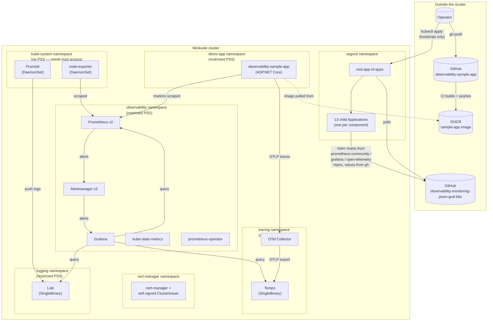

# Architecture

Cross-cutting reference for how this project's observability platform is put together — the
"why", not the step-by-step "how" (that's `01-minikube-implementation.md`). Read this first;
everything else in `docs/` assumes the vocabulary and decisions established here.

## 1. Goal

Build an enterprise-shaped observability platform (metrics, logs, traces — plus dashboards,
alerting, and a real instrumented workload to prove it all works) on Minikube, with **100% of
cluster state managed through ArgoCD** so the Git history *is* the change history. Then document
the same architecture as it would look natively on GKE and EKS, and package it as two
cloud-native Helm charts.

## 2. Architecture diagram



## 3. Components and why each exists

| Component | Namespace | Chart / source | Role |
|---|---|---|---|
| ArgoCD | `argocd` | vendored install manifest (Phase 2) | GitOps controller — the *only* thing ever `kubectl apply`'d by hand |
| cert-manager | `cert-manager` | `manifests/cert-manager/install.yaml` | Proves the self-signed-issuer → cloud-cert-manager pattern (Phase 12–13 will swap for GCP/AWS-managed certs) |
| kube-prometheus-stack | `observability` | Helm, `prometheus-community/kube-prometheus-stack` | Prometheus (metrics + alert evaluation), Alertmanager (routing), Grafana (dashboards), kube-state-metrics, the Prometheus Operator itself |
| Loki + Promtail | `logging` (Loki) / `kube-system` (Promtail) | Helm, `grafana/loki` + `grafana/promtail` | Cluster-wide log aggregation |
| Tempo + OTel Collector | `tracing` | Helm, `grafana/tempo` + `open-telemetry/opentelemetry-collector` | Distributed tracing backend + vendor-neutral OTLP ingest gateway |
| observability-sample-app | `demo-app` | own repo + GHCR image | The real workload that proves the whole pipeline — not synthetic load |
| node-exporter | `kube-system` | subchart of kube-prometheus-stack, `namespaceOverride` | Host-level metrics; needs hostNetwork/hostPID/hostPath, incompatible with `restricted` PSS |

## 4. Key architectural decisions

**Everything through ArgoCD, one exception.** The only manifests ever applied by hand are
ArgoCD's own install and the single root `Application` that bootstraps the App-of-Apps pattern
(`bootstrap/root-app.yaml`). Every other object — namespaces, RBAC, NetworkPolicy, the entire
metrics/logs/traces stack, dashboards, alert rules, the sample app — is a child `Application`
under `argocd-apps/`, each pointing at either a directory of raw manifests or a pinned Helm
chart version with values sourced from this same repo. Git commit history *is* the manifest
history the plan set out to have.

**Namespace-per-concern multi-tenancy.** `observability` / `logging` / `tracing` / `demo-app`,
each with its own `ResourceQuota` and `LimitRange` (Phase 3), `restricted` Pod Security Standard
labels (Phase 4), and default-deny `NetworkPolicy` with explicit allows (Phase 4). `kube-system`
deliberately opts out of the PSS restriction — it hosts the two DaemonSets (`node-exporter`,
`promtail`) that need genuine host access, which `restricted` forbids outright. This split was
flagged as a known, planned conflict *before* either component was deployed (see Phase 4/5/6
sections of the implementation doc), not discovered as a surprise.

**Everything pinned, nothing floating.** Minikube's Kubernetes version, every Helm chart
version, every container image tag — all pinned to an exact version, not `latest` or `stable`.
The sample app takes this further: its Deployment references an immutable commit-SHA image tag,
not a branch tag, so "what's running" always maps to an exact, inspectable commit.

**Calico, not the default bridge CNI.** Minikube's default CNI does not enforce NetworkPolicy at
all — proven via a live test where traffic crossed a `default-deny-all` policy that should have
blocked it. Switched to `--cni=calico` (Phase 4) specifically so NetworkPolicy has real teeth,
matching how GKE (Dataplane V2) and EKS (Calico/VPC CNI policy support) actually enforce it in
Phases 12–13.

**GitOps `selfHeal` is real, and it fights back.** `automated: {prune: true, selfHeal: true}` on
every Application means any live `kubectl`/`helm` edit not yet pushed to Git gets reverted,
usually within seconds. This was hit repeatedly during hands-on validation (NetworkPolicy fixes,
ResourceQuota bumps, image tag updates) and is documented as a recurring pattern in
`01-minikube-implementation.md` §Operational Lessons, along with the technique used to validate
a fix before pushing it (temporarily setting the relevant Application's `--sync-policy none`).

## 5. Repository map

```
Kubernetes-grafana-prometheus/        # this repo — platform/GitOps content only
├── bootstrap/                        # the one hand-applied exception (ArgoCD + root app)
├── argocd-apps/                      # one Application manifest per component (14 total)
├── manifests/                        # the actual desired-state content each Application points at
│   ├── namespaces/ rbac/ network-policies/ security/ cert-manager/   (Phases 3-4)
│   ├── kube-prometheus-stack/        (Phase 5)
│   ├── loki/                         (Phase 6)
│   ├── tempo/                        (Phase 7)
│   ├── sample-app/                   (Phase 8)
│   └── dashboards/ alert-rules/      (Phase 9)
├── scripts/                          # reproducible commands: 01 (cluster), 02 (ArgoCD), validate.sh (Phase 10)
├── docs/                             # you are here
└── charts/                           # Phase 14-15: the two cloud-native Helm charts (not yet built)

observability-sample-app/             # sibling repo — application code, never platform config
├── src/SampleApp/                    # ASP.NET Core, OpenTelemetry-instrumented
├── Dockerfile, .github/workflows/    # build + push to GHCR
```
